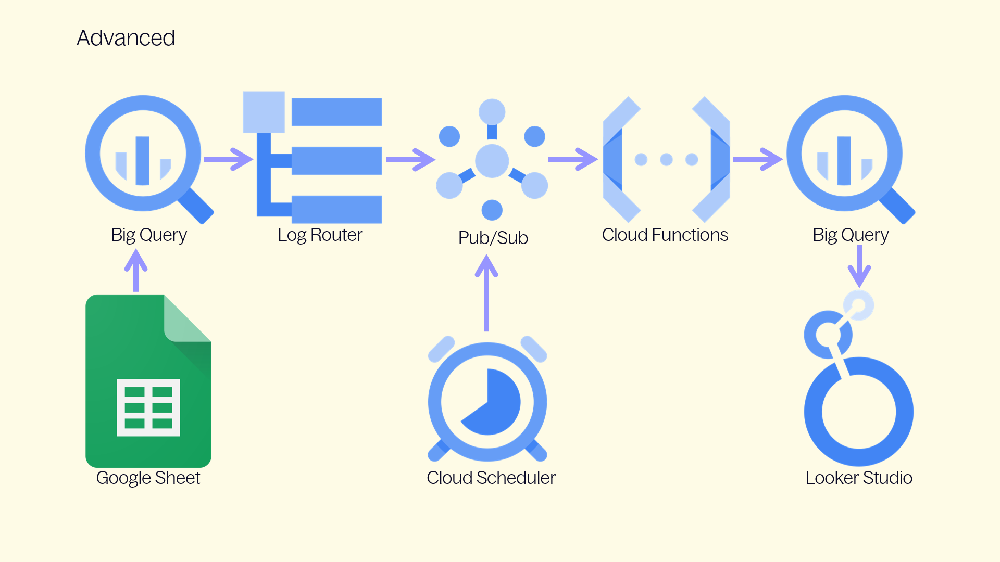

# BigQuery and Google Cloud setup

Google Sheet will create and upload data to the following BigQuery tables. 

| Table name  | Comment |
| ------------- | ------------- |
| ga4_documentation_events | Event documentation |
| ga4_documentation_parameters | Parameter documentation (only parameters that are used in Event documentation will be uploaded) |
| ga4_documentation_bq_settings | **Advanced Settings** Google Sheet |
| ga4_documentation_annotations | Annotations |

## Illustration of the Setup



## Anomaly Detection
In additon to the setup described on this page, there is also an **[Anomaly Detection Setup](Anomaly-Detection)**. Much of the setup there is similar to what described here, but it's documented independently.

Anomaly detection flags Events or Parameters with significant spikes or drops that aren’t explained by session fluctuations. New Events and Parameters are flagged independently. This helps you identify if something is broken or has changed.

## Google Cloud Setup

1. Create 2 [**Scheduled Queries**](#scheduled-queries-settings)
2. Create 2 [**Logs Router**](#create-the-logs-router)
3. Create 2 [**Cloud Functions**](#google-cloud-functions)
4. Create 1 [**Cloud Scheduler**](#cloud-scheduler)

## Scheduled queries
To get the final documentation result in BigQuery, we need to run 2 scheduled queries. These queries will create [5 different tables](#overview-over-tables-created-in-bigquery).

### Scheduled queries logic
All scheduled queries have this logic:

* If **events_fresh_** table exist (GA 360 only), query **only** this table including **today**.
  * If **events_fresh_** doesn't exist, query **events_** table until **yesterday**.
    * If **yesterday** doesn't exist in **events_** table, query **events_intraday_** (if the table exist), between **yesterday** and **today**.
      * Else query **events_intraday_** only for **today**.

### Scheduled queries settings
* Replace **your-project.analytics_XXXXX** with your project and data set
* Rest of the settings are done in **Google Sheet** in the **Settings** and **Advanced Settings** sheet.


| Scheduled query  | Comment |
| ------------- | ------------- |
| [ga4_documentation_events_and_documentation_status](ga4_documentation_events_and_documentation_status.sql) | This query creates 3 Tables: <ol><li> ga4_documentation_events_and_documentation_status </li><li> ga4_documentation_events_daily_counts</li> <li>ga4_documentation_events_and_images</li></ol> |
| [ga4_documentation_parameters_and_documentation_status](ga4_documentation_parameters_and_documentation_status.sql) | This query creates 2 tables: <ol> <li>ga4_documentation_parameters_and_documentation_status</li> <li>ga4_documentation_parameters_daily_counts</li></ol> |

* Scheduled queries should use **On-demand Repeat frequency**
* Do NOT tick the checkbox **Set a destination table for query results**. That logic is handled within the SQL query.
* Decide if you need to specify **Location type** (Ex. Multi-region and EU).
* Click **Save**.

**The complete setup works like this:**
1. If changes are made to the **ga4_documentation_events** table, a **Cloud Run Function** will automatically run some scheduled queries.
2. When **Cloud Scheduler** is run by a defined time, a **Cloud Run Function** will automatically run some scheduled queries.

The concept we use for this setup comes from a blog post on [**Simmer**](https://www.teamsimmer.com/2022/12/07/how-do-i-trigger-a-scheduled-query-when-the-ga4-daily-export-happens/) by _Simo Ahava_, but it differs slightly.

## Create the Logs Router
We are going to create 2 different **Logs Router**:

1. ga4_documentation_events_update
2. ga4_documentation_parameters_update


### 1. Create the Logs Router for ga4_documentation_events_update
This will kick off queries related to **events**.

* Go to [**Logs Router**](https://console.cloud.google.com/logs/router), and click the **CREATE SINK** button.
  * Give the sink a name, ex. **ga4_documentation_events_update**.
  * Choose **Google Cloud Pub/Sub topic** as the destination.
  * From the list of available Pub/Sub topics, click to **create a new topic**.
  * Create a Topic ID, ex. **ga4_documentation_events_update**.
  * In the **Build inclusion filter**, copy the filter below, but replace **analytics_XXX** with your **Dataset ID**.

 #### Build inclusion filter

```sql

protoPayload.methodName="jobservice.jobcompleted"
protoPayload.serviceData.jobCompletedEvent.job.jobConfiguration.load.destinationTable.datasetId="analytics_XXX"
protoPayload.serviceData.jobCompletedEvent.job.jobConfiguration.load.destinationTable.tableId="ga4_documentation_events"

```

### 2. Create the Logs Router for ga4_documentation_parameters_update
This will kick off queries related to **parameters**.

* Go to [**Logs Router**](https://console.cloud.google.com/logs/router), and click the **CREATE SINK** button.
  * Give the sink a name, ex. **ga4_documentation_parameters_update**.
  * Choose **Google Cloud Pub/Sub topic** as the destination.
  * From the list of available Pub/Sub topics, click to **create a new topic**.
  * Create a Topic ID, ex. **ga4_documentation_parameters_update**.
  * In the **Build inclusion filter**, copy the filter below, but replace **analytics_XXX** with your **Dataset ID**.

 #### Build inclusion filter

```sql

protoPayload.methodName="jobservice.jobcompleted"
protoPayload.serviceData.jobCompletedEvent.job.jobConfiguration.query.destinationTable.datasetId="analytics_XXX"
protoPayload.serviceData.jobCompletedEvent.job.jobConfiguration.query.statementType="DELETE"
protoPayload.serviceData.jobCompletedEvent.job.jobConfiguration.query.destinationTable.tableId="ga4_documentation_events_daily_counts"

```

## Google Cloud Functions
* You have to create 2 Cloud Functions, 1 for each scheduled query.

### Google Cloud Functions for the documentation solution
Create these 2 **Cloud Functions**:

1. ga4_documentation_events_update
2. ga4_documentation_parameters_update


Both functions are identical, except for the **configId**.

Go to [**Cloud Functions**](https://console.cloud.google.com/functions/list), and click **Create function**.

* **Configuration page**
  * Keep environment as **1st gen**.
  * Give the function a descriptive name.
  * Choose **Cloud Pub/Sub** as the trigger type.
  * Select the **Pub/Sub topic** you created in the previous chapter as the trigger.
  * Check the box **Retry on failure**.
  * Click **Save** to save the trigger settings.
  * Ignore the Runtime, build, connections and security settings accordion and click **Next** to continue.
* **Code page**
  * Keep Node.js as the runtime (choose the latest non-Preview version).
  * Click **package.json** to edit its contents.
    * Add the following code:
	
	        {
             "name": "sample-pubsub",
             "version": "0.0.1",
             "dependencies": {
              "@google-cloud/pubsub": "^0.18.0",
              "@google-cloud/bigquery-data-transfer": "^3.1.3"
             }
            }
  * Select **index.js** from the list of files to activate the code editor.
    * Edit the Entry point field on top of the editor to be **runScheduledQuery**.
    * Copy-paste the **index.js** code below into the editor.
    * Change the **projectId** value to match your **Google Cloud Platform project ID**.
    * To get values for **region** and **configId**, browse to [**scheduled queries**](https://console.cloud.google.com/bigquery/scheduled-queries), open your scheduled query, and click the **Configuration tab** to view its details.
    * **region** value should be the Google Cloud region of the Destination dataset, so click through to that to check if you don’t remember what it was.
    * **configId** is the **GUID** at the end of the **Resource name** of the scheduled query.
   
#### index.js
```javascript

const bigqueryDataTransfer = require('@google-cloud/bigquery-data-transfer');

exports.runScheduledQuery = async (event, context) => {
    // Update configuration options
    const projectId = 'REPLACE-THIS';
    const configId = 'REPLACE-THIS';
    const region = 'REPLACE-THIS';

    const d = new Date();
    const year = d.getFullYear(),
        month = d.getMonth(),
        day = d.getDate();

    const runTime = new Date(Date.UTC(year, month, parseInt(day), 12));
    // Create a proto-buffer Timestamp object from this
    const requestedRunTime = bigqueryDataTransfer.protos.google.protobuf.Timestamp.fromObject({
        seconds: runTime / 1000,
        nanos: (runTime % 1000) * 1e6
    });

    const client = new bigqueryDataTransfer.v1.DataTransferServiceClient();
    const parent = client.projectLocationTransferConfigPath(projectId, region, configId);

    const request = {
        parent,
        requestedRunTime
    };

    const response = await client.startManualTransferRuns(request);
    return response;
};

```

## Cloud Scheduler
The purpose of the Cloud Scheduler is to run a daily update of the queries to get **last seen**, **daily count** and the latest **documentatin status** for Events & Parameters.

* Go to **[Cloud Scheduler](https://console.cloud.google.com/cloudscheduler)**, click **Create Job**.
* Define the schedule
  * **Name:** ga4_documentation_events_and_parameters_update
  * **Select Region**
  * **Description:** Cloud Scheduler for GA4 Documentation solution
  * Select a **Frequency** that runs the scheduler 1 time per day. I'm using **\30 8 * * *\**, meaning the scheduler will run 08:30 every morning.
* Configure the execution
  * **Target:** Pub/Sub
  * **Select a Cloud Pub/Sub topic;** ga4_documentation_events_update
  * Write something relevant in **Message body**, ex. _ga4_documentation_events_and_parameters_update_schedule_.
* Configure optional settings
  * Leave **Retry config** as is, or set **Max retry attempts** to **1** _just in case_.
* Click **Create**

## Testing scheduled queries setup
To test the setup, simply go to the **Google Sheet**, select the **📈 GA4 Documentation Menu** at the top of the sheet, and select **BigQuery -> Export Event & Parameter Documentation**.

This will run a BigQuery query using Apps Script. If this is completed without errors, you should now see 5 new tables in BigQuery:

1. ga4_documentation_events_and_documentation_status
2. ga4_documentation_events_daily_counts
3. ga4_documentation_events_and_images
4. ga4_documentation_parameters_and_documentation_status
5. ga4_documentation_parameters_daily_counts

# Overview over tables created in BigQuery

The following BigQuery tables will be used in **Looker Studio**:
1. [ga4_documentation_events_and_documentation_status](#table-ga4_documentation_events_and_documentation_status)
2. [ga4_documentation_events_daily_counts](#table-ga4_documentation_events_daily_counts)
3. [ga4_documentation_events_and_images](#table-ga4_documentation_events_and_images)
4. [ga4_documentation_parameters_and_documentation_status](#table-ga4_documentation_parameters_and_documentation_status)
5. [ga4_documentation_parameters_daily_counts](#table-ga4_documentation_parameters_daily_counts)
6. [ga4_documentation_annotations](#table-ga4_documentation_annotations)
7. [ga4_documentation_bq_settings](#ga4_documentation_bq_settings)

## Event related tables

### Table: ga4_documentation_events_and_documentation_status
* Most of these field are also described in the **Google Sheet** documentation.
* This query will generate the table: [ga4_documentation_events_and_documentation_status query](ga4_documentation_events_and_documentation_status.sql) 

| Field name  | Type | Comment |
| ------------- | ------------- | ------------- |
| event_group | STRING | Event Group. Used for event categorization. |
| event_name | STRING | Event Name |
| event_method | STRING | Type of tracking/data collection method. Implementation, Google Tag Manager setup etc. |
| event_type | STRING | Type of event. Standard, custom event etc. |
| key_event | BOOLEAN | Is the Event a Key Event |
| key_event_counting | STRING | How is the Key Event counted (event/session) |
| event_description | STRING | Event Description |
| event_comment | STRING | Event Comment. Additional information about the event |
| event_gtm_comment | STRING | Comment related to Google Tag Manager or GA4 setup. Ex. name of Tag in GTM that tracks this Event |
| event_documentation_status | STRING | Documentation in Google Sheet is joined with GA4 BQ data. Status can be: **Documented and Data**, **Documented no Data** and **Not Documented** |
| platform_web | BOOLEAN | Coalesce of Google Sheet and GA4 BQ data. Is (or should) Event Name (be) tracked in the **Web platform** |
| platform_android | BOOLEAN | Coalesce of Google Sheet and GA4 BQ data. Is (or should) Event Name (be) tracked in the **Android platform** |
| platform_ios | BOOLEAN | Coalesce of Google Sheet and GA4 BQ data. Is (or should) Event Name (be) tracked in the **iOS platform** |
| event_count_total | INTEGER | GA4 BQ data. Total Event Count |
| event_count_web | INTEGER | GA4 BQ data. Event Count for **Web platform** |
| event_count_android | INTEGER | GA4 BQ data. Event Count for **Android platform** |
| event_count_ios | INTEGER | GA4 BQ data. Event Count for **iOS platform** |
| event_edited_time | DATETIME | Time when Event was edited in Google Sheet |
| event_uploaded_to_bq_time | DATETIME | Time when Event documentation was uploaded to BQ |
| event_last_seen_date_total | DATE | Date showing the last date the Event was "seen" overall |
| event_last_seen_date_web | DATE | Date showing the last date the Event was "seen" in the **Web platform** |
| event_last_seen_date_android | DATE | Date showing the last date the Event was "seen" in the **Android platform** |
| event_last_seen_date_ios | DATE | Date showing the last date the Event was "seen" in the **iOS platform** |
| event_first_seen_date_total | DATE | Date showing the first date the Event was "seen" overall. |
| event_first_seen_date_web | DATE | Date showing the first date the Event was "seen" in the **Web platform**. |
| event_first_seen_date_android | DATE | Date showing the first date the Event was "seen" in the **Android platform**. |
| event_first_seen_date_ios | DATE | Date showing the first date the Event was "seen" in the **iOS platform**. |

### Table: ga4_documentation_events_daily_counts
* This query will generate the table: [ga4_documentation_events_and_documentation_status query](ga4_documentation_events_and_documentation_status.sql)
* As standard, data older than 365 days will be automatically deleted. 

| Field name  | Type | Comment |
| ------------- | ------------- | ------------- |
| event_date | DATE | Event Date |
| event_name | STRING | Event Name |
| event_count_total | INTEGER | Daily Total Event Count across web and apps |
| event_count_web | INTEGER | Daily Event Count for **Web platform** |
| event_count_android | INTEGER | Daily Event Count for **Android platform** |
| event_count_ios | INTEGER | Daily Event Count for **iOS platform** |

### Table: ga4_documentation_events_and_images
* This query will generate the table: [ga4_documentation_events_and_images.sql](ga4_documentation_events_and_images.sql)

| Field name  | Type | Comment |
| ------------- | ------------- | ------------- |
| event_name | STRING | Event Name |
| event_image_documentation | STRING | URL to image |

## Parameter related tables

### Table: ga4_documentation_parameters_and_documentation_status
* Most of these field are also described in the **Google Sheet** documentation.
* This query will generate the table: [ga4_documentation_parameters_and_documentation_status query](ga4_documentation_parameters_and_documentation_status.sql)

| Field name  | Type | Comment |
| ------------- | ------------- | ------------- |
| event_name | STRING | Event Name |
| parameter_group | STRING | Parameter Group |
| parameter_display_name | STRING | Parameter Display Name |
| parameter_name | STRING | Parameter Name |
| parameter_scope | STRING | Parameter Scope. EVENT, USER, ITEM |
| parameter_type | STRING | Parameter Type. Custom Dimension, Custom Metric etc. |
| parameter_format | STRING | Parameter Format. String, Currency, Standard etc. |
| parameter_disallow_ads_personalization | BOOLEAN | NPA (Non-Personalized Ads) |
| parameter_example_value | STRING | Parameter example value |
| parameter_description | STRING | Parameter Description |
| parameter_gtm_comment | STRING | Comment related to Google Tag Manager or GA4 setup. Ex. name of Variable, Data Layer Name etc. |
| ga4_config_parameter | BOOLEAN | Parameters in Google Sheet that in the **Events** Sheet is added to the "fake" **ga4_config** Event Name will get this **flag**. These are global parameters that don't belong to a specific Event. |
| parameter_count_total | INTEGER | How many times have the parameter been seen across Events and all Platforms |
| parameter_count_web | INTEGER | How many times have the parameter been seen across Events and the **Web platform** |
| parameter_count_android | INTEGER | How many times have the parameter been seen across Events and the **Android platform** |
| parameter_count_ios | INTEGER | How many times have the parameter been seen across Events and the **iOS platform** |
| platform_web | BOOLEAN | Coalesce of Google Sheet and GA4 BQ data. Is (or should) Parameter (be) tracked in the **Web platform** |
| platform_android | BOOLEAN | Coalesce of Google Sheet and GA4 BQ data. Is (or should) Parameter (be) tracked in the **Android platform** |
| platform_ios | BOOLEAN | Coalesce of Google Sheet and GA4 BQ data. Is (or should) Parameter (be) tracked in the **iOS platform** |
| parameter_last_seen_date_total | DATE | Date showing the last date the Parameter was "seen" overall |
| parameter_last_seen_date_web | DATE | Date showing the last date the Parameter was "seen" in the **Web platform** |
| parameter_last_seen_date_android | DATE | Date showing the last date the Parameter was "seen" in the **Android platform** |
| parameter_last_seen_date_ios | DATE | Date showing the last date the Parameter was "seen" in the **iOS platform** |
| parameter_first_seen_date_total | DATE | Date showing the first date the Parameter was "seen" overall |
| parameter_first_seen_date_web | DATE | Date showing the first date the Parameter was "seen" in the **Web platform** |
| parameter_first_seen_date_android | DATE | Date showing the first date the Parameter was "seen" in the **Android platform** |
| parameter_first_seen_date_ios | DATE | Date showing the first date the Parameter was "seen" in the **iOS platform** |

### Table: ga4_documentation_parameters_daily_counts
* This query will generate the table: [ga4_documentation_parameters_and_documentation_status query](ga4_documentation_parameters_and_documentation_status.sql)
* As standard, data older than 365 days will be automatically deleted. You can change this in the SQL.

| Field name  | Type | Comment |
| ------------- | ------------- | ------------- |
| event_date | DATE | Event Date |
| parameter_name | STRING | Parameter Name |
| parameter_scope | STRING | Parameter Scope |
| event_name | STRING | Event Name |
| parameter_count_total | INTEGER | Daily Total Parameter Count across Web and apps |
| parameter_count_web | INTEGER | Daily Parameter Count for **Web platform** |
| parameter_count_android | INTEGER | Daily Parameter Count for **Android platform** |
| parameter_count_ios | INTEGER | Daily Parameter Count for **iOS platform** |

## Settings table

### Table: ga4_documentation_bq_settings

| Field name  | Type | Comment |
| ------------- | ------------- | ------------- |
| events_exclusion | STRING | Events that should be excluded from queries. Events comes from **Exclude Events from SQL Query** in **Settings** in Google Sheet. |
| parameters_exclusion | STRING | Parameters that should be excluded from queries. Parameters comes from **Exclude Params from Query** in **Settings** in Google Sheet. |
| ep_day_interval_short | INTEGER | Number of days to query for Events and Parameters  (e.g. last 1 day). Value comes from **Day Interval Short** in **Advanced Settings** in Google Sheet. Declared in query as **day_interval_short**.					 |
| ep_day_interval_extended | INTEGER | Number of days to query the first time to get some event & parameter count data. If you have lot's of data, cost may occour if you are selecting a long period. For anomaly detection you need at least 28 days of data. Value comes from **Day Interval Extended** in **Advanced Settings** in Google Sheet. Declared in query as **day_interval_extended**. |
| ep_delete_event_count_after_days | INTEGER | Event  & parameter daily count data older than this will be deleted. Value comes from **Delete Count Data After Number of Days** in **Advanced Settings** in Google Sheet. Declared in query as **delete_event_count_after_days**.	|
| anomaly_day_interval_short | INTEGER | Number of days to check for anomalies (e.g., last 1 day). Value comes from **Day Interval Short Anomalies** in **Advanced Settings** in Google Sheet. Declared in query as **day_interval_short**. |
| anomaly_day_interval_extended | INTEGER | Number of days to query the first time to get some session count data. Value comes from **Day Interval Extended Anomalies** in **Advanced Settings** in Google Sheet. Declared in query as **day_interval_extended**. |
| anomaly_days_before_anomaly_detection | INTEGER | Minimum number of days of data collected before running anomaly detection. With standard deviation model, 28 days (as minimum) is recommended. With day of week adjustment, 56 or 84 is recommended. Value comes from **Minimum Number of Days before Anomaly Detection** in **Advanced Settings** in Google Sheet. Declared in query as **days_before_anomaly_detection**. |
| anomaly_day_interval_large | INTEGER | Number of Days for rolling statistics (e.g., last 90 days). Value comes from **Rolling Statistics Interval** in **Advanced Settings** in Google Sheet. Declared in query as **day_interval_large**. |
| anomaly_delete_anomaly_data_after_days | INTEGER | Anomaly data older than this will be deleted. Value comes from **Delete Anomaly Data After Number of Days** in **Advanced Settings** in Google Sheet. Declared in query as **delete_anomaly_data_after_days**. |
| anomaly_day_interval_new_events_params | INTEGER | Number of days to check for new events and parameters. (e.g. last 1 day). Value comes from **Number of Days to check for new Events or Parameters** in **Advanced Settings** in Google Sheet. Declared in query as **day_interval_new_events_params** |
| anomaly_stddev_model_setting | STRING | Standard Deviation model can either be 'standard' or 'dayofweek'. dayofweek = adjusted for day of week. standard = not adjusted for day of week. Value comes from **Standard Deviation Model Setting** in **Advanced Settings** in Google Sheet. Declared in query as **stddev_model_setting**. |
| anomaly_stddev_multiplier | FLOAT | Multiplier for standard deviation. Standard deviation for events and parameters. Scale goes from 1 to 3. Default setting is 3; lower sensitivity, fewer false positives. Value comes from **Standard Deviation Multiplier** in **Advanced Settings** in Google Sheet. Declared in query as **stddev_multiplier**. |
| anomaly_events_explained_by_sessions_threshold | FLOAT | If an event anomaly is reported, and should have been explained by changes in sessions, increase the number. Decrease the number for the opposite scenario. Value comes from **Events Explained by Sessions Threshold** in **Advanced Settings** in Google Sheet. Declared in query as **events_explained_by_sessions_threshold**.	|
| anomaly_parameters_explained_by_sessions_threshold | FLOAT | If an parameter anomaly is reported, and should have been explained by changes in sessions, increase the number. Decrease the number for the opposite scenario. Value comes from **Parameters Explained by Sessions Threshold** in **Advanced Settings** in Google Sheet. Declared in query as **parameters_explained_by_sessions_threshold**. |

## Annotations

### Table: ga4_documentation_annotations
* This table is created when you upload **Annotations** from **Google Sheet** to BigQuery.

| Field name  | Type | Comment |
| ------------- | ------------- | ------------- |
| annotation_time | DATETIME | Time when annotation was added |
| annotation_added_by_email | STRING | Email of the person who added the annontation (if available or not redacted) |
| annotation_category | STRING | Annotation Category; GA4 Change History, GTM (Web), Marketing etc. |
| annotation_description | STRING | Annotation description |
| annotation_ga4_gtm_info | STRING | Info/API ID's from GA4 or GTM |
| annotation_uploaded_to_bq_time | DATETIME | Time when the annotation was uploaded to BigQuery. |
