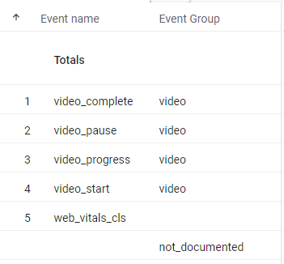

# Firestore and Server-side Google Tag Manager

For those using **Server-side Google Tag Manager** (sGTM), **Firestore** can enhance real-time data collection. Here are some use cases:

- **Flag** undocumented GA4 Events.
- **Route** undocumented GA4 Events to a different GA4 Property.
- **Block** undocumented GA4 Events.
- Add an **event_group** parameter from your documentation to the **Event Name** in real-time.

This functionality parallels some features found in other event-based analytics tools and third-party documentation solutions.

## Syncing GA4 Events & Parameters to Firestore

[**Google Cloud Firestore**](https://cloud.google.com/firestore) is a scalable NoSQL document database ideal for performance-driven applications. Firestore is accessible from Apps Script using the [**Firestore library**](https://github.com/grahamearley/FirestoreGoogleAppsScript).

Firestore’s daily free quota includes 50,000 document Reads, 20,000 document Writes, and 20,000 document Deletes. See [**Firestore pricing**](https://cloud.google.com/firestore/pricing) for details.

**Syncing GA4 Events & Parameters to Firestore works as follows:**

- If an Event Name is missing in Firestore, it’s added with its parameters.
- If an Event Name is in both Firestore and Google Sheet, it’s updated.
- If an Event Name is in Firestore but not in Google Sheet, it’s deleted from Firestore.

**Data synchronized with Firestore includes:**

| Parameter       | Description                                                                                     |
|-----------------|-------------------------------------------------------------------------------------------------|
| change_status   | **added** or **updated**                                                                        |
| date_edited     | Date when the event_name or parameters were last edited. From the Autofilled Time column.       |
| event_group     | **Event Group** from the Events Sheet                                                           |
| event_name      | **Event Name** from the Events Sheet                                                            |
| event_parameters | **Event Parameters** from the Events Sheet (Array)                                             |
| items           | **Item Parameters** from the Events Sheet (Array)                                               |
| user_properties | **User Scoped Parameters** from the Events Sheet (Array)                                        |

## Google Cloud & Firestore Setup

You can either create a new [**Google Cloud Project**](https://console.cloud.google.com/projectcreate) for Firestore or add it to your existing **sGTM project**.

### Firestore Setup

1. [Select a Cloud Firestore mode](https://console.cloud.google.com/firestore/create-database):
   - Choose Native Mode
2. Choose a data location
   - Create Database

#### Create a Google Service Account

To link Firestore with Google Sheets, create a **Google Service Account** with **read/write access**:

1. Visit the [**Google Service Accounts page**](https://console.cloud.google.com/projectselector2/iam-admin/serviceaccounts).
2. Select the Firestore project and click **Create Service Account**.
3. For the role, select **Datastore > Cloud Datastore Owner**.
4. Enable **“Furnish a new private key”** and select **JSON** as the key type.
5. Click **Create** to download a **.json** file with your private key, then save it locally.

## Firestore Setup in Google Sheet

1. Go to the **Settings** Sheet and **Firestore settings**.
2. Insert the following values from the .json file:
   - **Client Email** → **client_email**
   - **Project ID** → **project_id**
   - **Private Key** → **private_key**
3. **First Collection** → Suggested name **event_data**.
   - See [**Firestore Collections**](https://cloud.google.com/firestore/docs/data-model#collections) for more info.
4. **Sheet Settings** → **Date Format**. Use the dropdown menu.
   - Date comes from **Autofilled Time** in the **Event Sheet**.

Firestore settings are stored as [**Apps Script Script Properties**](https://developers.google.com/apps-script/guides/properties).

## Server-side Google Tag Manager Setup

To **flag**, **block**, or **route** undocumented Events in **Server-side GTM**, a **Firestore Lookup Variable** is used. This example flags undocumented Events.

### Firestore Lookup Variable

To set up, use a **Firestore Lookup Variable**. For more details, see [**Enrich Server-side Data With Cloud Firestore**](https://www.simoahava.com/analytics/enrich-server-side-data-with-cloud-firestore/) by _Simo Ahava_. Pay particular attention to the [**Override Project ID section**](https://www.simoahava.com/analytics/enrich-server-side-data-with-cloud-firestore/#override-project-id) if sGTM and Firestore are in separate projects.

| Settings           | Value                      | Description                                                                                                      |
|--------------------|----------------------------|------------------------------------------------------------------------------------------------------------------|
| Lookup type        | Document path              | “Look up a document by specifying its components (collection, document, subcollection).”                         |
| Document path      | event_data/{{Event Name}}  | If using a different **First Collection**, replace **event_data** with that name.                               |
| Key Path           | event_group                | Returns **Event Group** from Google Sheet.                                                                       |
| Override Project ID | your-firestore-project-id | Needed if Firestore is in a different Google Cloud Project.                                                      |
| Convert undefined  | not-documented             | Flags undocumented Events as **not-documented**.                                                                 |

Next, edit your **GA4 Tag** in **sGTM**. In **Parameters to Add / Edit**, add **event_group** as a parameter and your **Firestore Lookup Variable** as the **Value**.

In the **GA4 Explore report**, undocumented **Core Web Vital Events** are flagged as **not_documented**.

