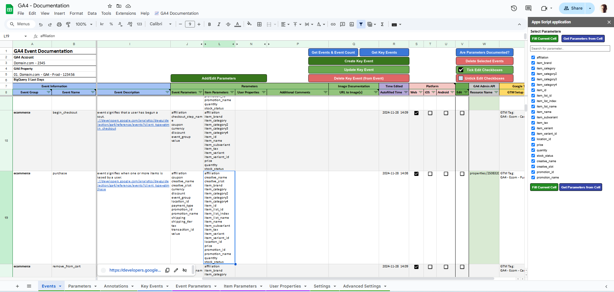
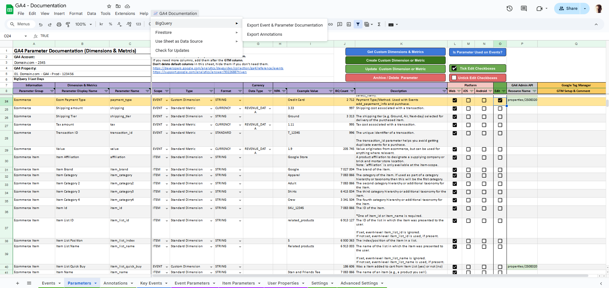

# Google Sheet documentation

Google Sheet is the backbone for all documentation and management, supported by Apps Script for automation.

## How to use the Google Sheet
* [**Make a copy of the Google Sheet**](https://docs.google.com/spreadsheets/d/162QAnKN7nBgRxOzsisKLlqzdAsGOk4r2wDe6lzBFbks/copy)
  * If you are a consultant and are doing the documentation on behalf of a client, it's recommended to copy the Google Sheet with an email belonging to the clients organization. This way ownership to the Google Sheet can be transferred within the clients organization.
* The Google Sheet comes prefilled with most common **GA4 Event Names** and **Parameters** (Dimensions / Metrics).
  * **Delete** Event Names and Parameters you don't need in your documentation.
* Go to [**Settings Sheet**](#settings) and input your settings.
  * You should at least fill out **GA4 Settings**, but it's highly recommended to fill out **BigQuery Settings** as well since some functionality only works with BigQuery.
* First, document all your [**Parameters**](#parameters) , then document your [**Events**](#events). How to do that is explained below.

The Google Sheet is using **Apps Script** for much of the functionality. See the [**Apps Script documentation**](Apps-Script) for more information.

## Sheets
| Sheet  | Comment |
| ------------- | ------------- |
| [Events](#events) | In this sheet you edit and document Events. |
| [Parameters](#parameters)  | In this sheet you edit and document Parameters (Standard Dimensions, Custom Dimensions, Standard Metrics, Custom Metrics). |
| [Annotations](#annotations)  | Annotations can be added manually, you can import GA4 Property Change History (if something is changed in the property, this is logged in the Change History), and you can import Google Tag Manager Container Versions.  |
| Key Events | Listing Events from the Events Sheet where the Event is marked as a Key Event. No functionality in this sheet. |
| Event Parameters | This Sheet is listing Parameters from the Parameters Sheet where the Scope of the Parameter is set to EVENT. No functionality in this sheet. |
| Item Parameters | This Sheet is listing Parameters from the Parameters Sheet where the Scope of the Parameter is set to ITEM. No functionality in this sheet. |
| User Properties | This Sheet is listing Parameters from the Parameters Sheet where the Scope of the Parameter is set to USER. No functionality in this sheet. |
| [Settings](#settings)  | Settings for Sheets functionality. |
| [Advanced Settings](#advanced-settings)  | Only relevant if you are using BigQuery as a Data Source for Looker Studio. |

## 📈 GA4 Documentation Menu
At the top of the sheet, you will find a custom menu called "**📈 GA4 Documentation**".

| Menu  | Description |
| ------------- | ------------- |
| BigQuery -> Export Event & Parameter Documentation | This is a manual export of Event & Parameter documentation. Only Events with mandatory columns filled out will be exported, and the same goes for Parameters. In addition, only Parameters added to a Event will be exported. |
| BigQuery -> Export Annotations | This is a manual export of Annotations from the Annontations Sheet. |
| Firestore -> Export Event Documentation | This is a manual export of Event & Parameter documentation to Firestore. |
| Use Sheet as Data Source -> Write Events & Parameters to Data Source Sheets | Writes Events & Parameter Documentation to some hidden Sheets using Apps Script in a format that Looker Studio can use as a Data Source. |
| Check for Updates | Check if there are any updates to the solution. If there is an update, follow the instructions. |

## Events
Here you document your Events. The most common GA4 Event Names are prefilled and described. 

### Buttons in Event Sheet
All buttons will trigger an Apps Script function. If you are doing bulk editing where the GA4 Admin API is "in play", beware that there are [**Limits and Quotas on API Requests**](https://developers.google.com/analytics/devguides/config/admin/v1/quotas).

| Button  | Description |
| ------------- | ------------- |
| Add/Edit Parameters | This button is for adding/editing Parameters (Event, Item or User Scoped). If you want to add Item Parameters to an Event, select the corresponding **Item Parameters** cell, and click the **Add/Edit Parameters** button. In the popup, select the Parameters you want to add to the Event, and click **Fill Current Cell**. |
| Get Events & Event Count | Events & Event Count can either be downloaded from the **API**, or from **BigQuery**. Use the setting **Get GA4 Event & Parameters from** in the **Settings** Sheet to select API or BigQuery.    Use BigQuery if you experience **(other)** issues, if you want todays data included (**Streaming** export must be actived in GA4). BigQuery will also download which **platform** (Web, iOS or Android) the event belongs to. If **Edit checkbox** is ticked for an existing event, platform will automatically be added to selected event(s). |
| Get Key Events | This will download Key Events from GA4. If this/these Key Event(s) doesn't exist in the Event Sheet, they will be added after the last row in the Sheet. If the Event exist in the Sheet, corresponding row in **Resource Name** column will be highlighted green, and a Resource Name will be added. **Key Event** checkbox and **Counting Method** will not be updated, **unless** you tick the **Edit** checkbox. This is to prevent overriding existing documentation by accident. |
| Create Key Event | Select Event(s) (**Edit** checkbox) that you want make a Key Event. |
| Update Key Event | Select Key Event(s) (**Edit** checkbox) that you want to update. Updates you can do to a Key Event is to select either **ONCE_PER_EVENT** or **ONCE_PER_SESSION**. |
| Delete Key Event from Event | Select Key Event(s) (**Edit** checkbox) that you want to delete. This will delete / archive the Key Event in GA4. You will be prompted to verify that you want to delete these Key Events before the deletion happens.  |
| Are Parameters Documented? | Select Events (**Edit** checkbox) that you want to check. Event, Item & User Parameters for that/these Event(s) will be checked against the Parameter documentation. If undocumented Parameters in the Event Sheet is found, you will get the option to delete those Parameters from ALL Events. Bulk deletion is not a problem. |
| Delete Selected Events | All Events selected in the **Edit** column will be deleted (rows will be deleted). If the Event is also a **Key Event**, the Key Event in GA4 will also be deleted / archived. Be careful with bulk deletion. You will be prompted to verify that you want to delete this/these Event(s) before the deletion happens. |
| Tick Edit Checkboxes | This will **select ALL** checkboxes. |
| Untick Edit Checkboxes| This will **deselect ALL** checkboxes. |

### Columns in Event Sheet
The different columns in the Sheet are described below.

| Column Name  | Description |
| ------------- | ------------- |
| Event Group | Grouping Events together with a event_group parameter is a good thing to do. It can make it easier to understand your Events, and do queries in BigQuery. The Event Group parameter will also be used in the Firestore to Server-side GTM integration. How to group the Events is up to you. Event Group **must be filled out** if you are going to export the documentation to BigQuery. |
| Event Name | Type the **Event Name** here. If the Event Name is a **duplicate**, the cell will be highlighted with a red color. If the Event Name is written in a format that isn’t **snake_case**, input will be rejected. Enforcing **snake_case** can be turned off in the **Settings Sheet**. Event Name **must be filled out** if you are going to export the documentation to BigQuery. Automatically collected Events (first_visit, first_open, session_start and user_engagement) are excluded from the documentation. Also notice the "special" Event **ga4_config**. DO NOT DELETE this Event. This Event is for documenting global Parameters, and has some functionality attached to it. |
| Data Colletion | Select from a drop-down list how this Event is generated. This is just for your own documentation. |
| Event Type | Select from a drop-down list what kind of Event this is. This is just for your own documentation. |
| Key Event | Tick the **checkbox** if this Event is a **Key Event**. |
| Counting Method | After you have ticked the **checkbox**, you can select if the Key Event is **ONCE_PER_EVENT** or **ONCE_PER_SESSION**. |
| Event Count | If you click on the **Get Events & Event Count** button, Event Count will be written to this column. Event Count can either be downloaded from the **API** or **BigQuery**. |
| Event Description | Write a description for the Event here. Event Description **must be filled out** if you are going to export the documentation to BigQuery. |
| Event Parameters | Event Parameters are added here. Do not Edit cells manually, since this may break some functionality. Only add Parameters to a cell by using the Apps Script application, or copy + paste from another Event Parameter cell. |
| Item Parameters | Item Parameters are added here. Do not Edit cells manually, since this may break some functionality. Only add Parameters to a cell by using the Apps Script application, or copy + paste from another Item Parameter cell.  If Item Parameters aren't relevant for your documentation, just hide the Item Parameters column. |
| User Properties | User Scoped Parameters are added here. Do not Edit cells manually, since this may break some functionality. Only add Parameters to a cell by using the Apps Script application, or copy + paste from another User Property cell.  If User Properties aren't relevant for your documentation, just hide the User Properties column. |
| Additional Comments | Add Additional Comments here, ex. describing what Parameters are tracking specifically for this Event. |
| URL to Image(s) | Sometimes words can't describe the Event good enough, and you need image(s)/illustration(s) to document the Event. Paste URL(s) to images in this cell. Separate several image URLs with **new line** (line break).  Alt or Ctrl + Enter (**Windows**) or Cmd + Enter (**Mac**). See also [**Image Documentation**](#image-documentation). |
| Autofilled Time | If any cell is changed to the left of the **Autofilled Time** column, this column will be autofilled with the time the change was made. |
| Web / iOS / Android | If the Event is used on Web, tick the Website **checkbox**, and vice versa for iOS/Android. If neither Web, iOS or Android is selected, the Event will not be exported to BigQuery.   If you are downloading **Event Count** from **BigQuery**, and the **Edit checkbox** is ticked, these platform checkboxes will be automatically ticked for selected Event(s). |
| Edit | Tick this checkbox for functionally related to that Event (see [Buttons in Event Sheet](#buttons-in-event-sheet)) |
| Resource Name | Resource Name ID will be added be added to this column if the Event is a Key Event in GA4 |
| GTM Setup & Comment | If you are using GTM/sGTM or are creating/modifying events within GA4, add relevant information here. Ex. name of the Tag in GTM/sGTM. |

### Image Documentation
Sometimes words can't describe the Event good enough, and you need image(s)/illustration(s) to document the Event. Where to store those images is up to you, but if you are going to export the documentation to [**Looker Studio**](Looker-Studio), images needs to be publicly available.

#### Google Drive
If you are storing the images in **Google Drive**, store them in a folder with the settings **Anyone on the Internet with the link can view**.
* Select the image you want to add to the documentation, and click **Share**, and **Copy link**, and add that link to **URL to Image(s)** cell.
 * Since Google Drive image URL's doesn't work in Looker Studio, URLs will automatically be rewritten to a usable format before they are stored.
 * Separate several image URLs with new line (line break). Alt or Ctrl + Enter (Windows) or Cmd + Enter (Mac). 

## Parameters
Description of the Parameters sheet.

### Buttons in Parameter Sheet
All buttons will trigger an Apps Script function.

| Button  | Description |
| ------------- | ------------- |
| Get Custom Dimensions & Metrics | If **API** is selected in **Settings** Sheet, Parameters (Custom Dimensions & Metrics) will be downloaded from GA4. If the Parameter exist in the Sheet, corresponding row in **Resource Name** column will be highlighted in green, and a Resource Name will be added. **Parameter Display Name** and **Description** will not be updated, **unless** you tick the **Edit** checkbox. This is to prevent overriding existing documentation by accident. If **BigQuery** is selected Parameters from BigQuery including a Parameter Count will be downloaded. Use the setting **Get GA4 Event & Parameters from** in the **Settings** Sheet to select **API** or **BigQuery**. If there is no match between Parameters in the Sheet and Parameters being downloaded, these Parameters will be added after the last row in the Sheet. |
| Greate Custom Dimension or Metric | Fill out necessary information for the Parameter, select the corresponding **checkbox** in the **Edit** column, and click the button. It's possible to bulk create Custom Dimensions or Metrics, but beware of the API quota. |
| Update  Custom Dimension or Metric | Fill out necessary information for the Parameter, select the corresponding **checkbox** in the **Edit** column, and click the button. It's possible to bulk update Custom Dimensions or Metrics, but beware of the API quota. It's not possible to **edit CURRENCY Custom Metrics** from the Sheet. |
| Archive / Delete  Parameter | Use this to **delete Custom Dimensions & Metrics**. Select the corresponding **checkbox** in the **Edit** column, and click the button. Bulk deletes are possible, but use that with caution. |
| Is Parameter Used on Events? | Use this funcionality to check if Parameters in the Parameters Sheet are being used in the Events Sheet. Tick **checkboxes** for the **corresponding Parameter** that you want to check. If unused Parameters are found, you will get the option to delete them. Use bulk deleting with caution. |
| Tick Edit Checkboxes | This will **select ALL** checkboxes. |
| Untick Edit Checkboxes| This will **deselect ALL** checkboxes. |

### Columns in Parameter Sheet
The different columns in the Sheet are described below.

| Column Name  | Description |
| ------------- | ------------- |
| Parameter Group | This is just for internal grouping of Parameters. How to group Parameters is up to you. Must be filled out if you are going to export the documentation to BigQuery. |
| Parameter Display Name | Type the **Parameter Display Name** here. Required. Display name for the Parameter Name as shown in the Analytics UI. Must be filled out if you are going to export the documentation to BigQuery. Max length of 82 characters, alphanumeric plus space and underscore starting with a letter. |
| Parameter Name | Type the **Parameter Name** here. Required. Must be filled out if you are going to export the documentation to BigQuery. May only contain alphanumeric and underscore charactes, starting with a letter (snake_case). Max length of 40 characters. |
| Scope | Select the **Parameter Scope** here. After you have selected the Scope, selections will be available for the particular Scope in the adjacent cells. |
| Type | Select the **Parameter Type** here. After you have selected the Type, selections will be available for the particular Type in the adjacent cells. |
| Format | Select the **Parameter Format** here. If you have selected CURRENCY, selections will be available for the particular Format in the adjacent cells. |
| Data Type | If you have selected CURRENCY, selections will be available for the particular Data Type in the adjacent cells. When you select CURRENCY as the unit of measure, you must also identify the custom metric as a cost and/or revenue metric. That identification is used in conjunction with user roles that restrict access to cost and/or revenue metrics. It's not possible to Edit a Custom Metric with CURRENCY in this Sheet. |
| NPA | Disallow Ads Personalization for User Properties. If Scope is set to USER, a checkbox will appear. Tick the checkbox to disable Ads Personalization for this User Property. |
| Example Value | Add an **Example Value** that helps to understand what this Parameter is tracking. |
| BQ Count | BigQuery Count of how many times this Parameter has been requested. Choose **BigQuery** in the **Get GA4 Event & Parameters from** settings in the **Settings** Sheet. |
| Description | Write a description of the parameter. Max length of 150 characters if this is a Custom Metric or Dimension. |
| Web / iOS / Android | If the Parameter is used on Web, tick the Website **checkbox**, and vice versa for iOS/Android. If neither Web, iOS or Android are selected, the Parameter will not be exported to BigQuery.   If you are downloading **Parameter Count** from **BigQuery**, and the **Edit checkbox** is ticked, these platform checkboxes will be automatically ticked for selected Parameters. |
| Edit | Checkboxes that are used together with the **buttons**. |
| Resource Name | It's an kind of ID returned from the API, and will be automatically filled out for Custom Dimensions and Metrics (list, create, update). Use this to identify if the Custom Dimension or Metrics exists in GA4. |
| GTM Setup & Comment | Use this to describe the Parameter in GTM/SGTM. Ex. name of Variable, how the value is created (Data Layer) etc. How detailed this description should be is up to you. |

## Annotations
At the time of writing, GA4 doesn't have annotations, so this is an attempt to at least present an alternative.

The reason for adding Annotations to this Sheet, is that if you create/delete a Key Event, Dimension or Metric - this may affect your data and should therefore be documented. Other things that may affect your data are changes made in **Google Tag Manager**.
To simplify this, you can download **GA4 Change History** for the property to the Sheet as annotations. The same goes with GTM, you can download **GTM Container Versions** as Annotations.

Annotations can also be added manually in the Sheet.

### GA4 Change History
**GA4 Account** and **Property** must have been selected in the **Settings** Sheet. In the Settings Sheet there is also **Annotation Settings**. Here you can select if the email of the user that made a change to something in the property should be written to the Sheet.

Options are:
* Write the email to the Sheet
* Redact the email. Ex. _e***********@knowit.no_. This can still give you a clue about who did the change, but no real email is written to the Sheet.
* Do not write the email to the Sheet. Instead of email, **Hidden by Settings** will be written to the Sheet.

Annotations can be downloaded manually with the **Get GA4 Change History** button, or automatically using a [**Trigger**](#triggers).

### Google Tag Manager (GTM)
To download **GTM Container Versions** as Annotations, **GTM Account** and **Container(s)** must be selected in the **Settings** Sheet. The different container types (web, server, iOS, Android and AMP) will be classified as different annotation categories.

GTM Container Version info that will be downloaded are:
* Version ID
* Version Name
* Version Date
* Version Description
* URL to the Version

The [**GTM API**](https://developers.google.com/tag-platform/tag-manager/api/v2) have for some reason no information about **who** made the change/published the container, so the text **Not Available from API** will be returned instead.

Suggested solution for downloading **GTM Container Versions** as Annotations:
* **Download Container Versions manually** the first time, using the **Get GTM Container Versions** button.
  * 3 latest versions will be downloaded.
* Add a [**Timer Trigger**](#triggers) that from now on and moving forward downloads new GTM Container Versions automatically.

## Settings
Description of the Settings sheet.

| Function  | Description | Comment |
| ------------- | ------------- | ------------- |
| Clear Settings Fields & Data | This will clear settings and data from the Sheet. | GA4 Settings, BigQuery Settings, GTM Settings, Firestore Settings, GA4 Account & Property helper Sheet, GTM Account & Container helper Sheet, GA4 API Event Data from helper Sheet, GA4 BigQuery Event Data from helper Sheet, GA4 BigQuery Parameter Data from helper Sheet, Event Data Source Sheet, Event Images Data Source Sheet, Parameters Data Source Sheet, Annotations Data Source Sheet, Event Count from Event Sheet, Resource Name (GA4 API) from Event Sheet, Parameter Resource Name (GA4 API) from Parameter Sheet, Parameter Count from Parameter Sheet & Annotations.  |
| **Sheet Settings** |
| Enforce snake_case | Enforce **snake_case** for Event Name & Parameter Name. Recommende setting is Yes, but if you download Events & Parameters from GA4 that isn't in this format, select No. |  |
| Date Format | Date format used in exports, annotations etc. |  |
| Reporting Period | Reporting Period when pulling data from GA4 (Reports & Change History). |  |
| Get GA4 Event & Parameters from | Get Event Count & Parameters (Dimensions & Metrics) from either API or BigQuery. |  |
| **GA4 Settings** | |
| Account| Click **Get GA4 Accounts** button to list GA4 Accounts you have access to. Select the GA4 Account from the dropdown list. |  |
| Property | After Account has been selected, click **Get GA4 Properties** button. Select Property. When you click the **Get GA4 Properties** button, ALL GA4 Accounts except the one selected will be deleted from the Sheet. |  |
| **BigQuery Settings** |
| Project ID | Google Cloud Project ID where GA4 BigQuery is located. |  |
| Data Set ID | BigQuery Data Set ID. This will be automatically suggested if **GA4 Property** and **BigQuery Project ID** is filled out. |  |
| Table ID (Event Table) | BigQuery Table ID for Event documentation. It's recommended to use the Table ID suggested in the Settings. |  |
| Table ID (Parameter Table) | BigQuery Table ID for Parameters (Dimensions & Metrics) documentation. It's recommended to use the Table ID suggested in the Settings. |  |
| Table ID (Annotation Table) | BigQuery Table ID for Annotations. It's recommended to use the Table ID suggested in the Settings. |  |
| Exclude Events from SQL Query | Not all Event Names are relevant for documentation, ex. automatic created events. Exclude these Events separated by comma. | session_start, first_visit, first_open, user_engagement, firebase_campaign, app_exception, app_remove, app_update, os_update, app_install, notification_dismiss, notification_foreground, notification_open, notification_receive, error, app_clear_data |
| Exclude Params from SQL Query | If you are getting parameters  from BigQuery instead of API, not all Event & User Scoped Parameters are relevant. Exclude these parameters separated by comma. Parameters are queried from key (event_params.key, user_properties.key & items.item_params.key) and items (item_name, item_id etc.). | batch_ordering_id, batch_page_id, campaign, campaign_info_source, debug_event, debug_mode, engaged_session_event, entrances, ga_session_id, ga_session_number, ignore_referrer, medium, page_title, session_engaged, source, term, unique_search_term, engagement_time_msec, page_referrer,  prevenue_28d,  dclid,  gclsrc,  gclid, srsltid, campaign_id, content, firebase_conversion,  firebase_screen_id, firebase_screen_class, firebase_event_origin, firebase_conversion, first_open_time, last_gclid, gad_source, firebase_error, fatal, previous_first_open_count, firebase_previous_id, previous_app_version, previous_os_version, system_app, update_with_analytics, traffic_type, system_app_update, firebase_screen, firebase_previous_class, firebase_previous_screen, client_id, _ltv_USD, _ltv_EUR, _ltv_JPY, _ltv_GBP, _ltv_CNY, _ltv_AUD, _ltv_CAD, _ltv_CHF, _ltv_HKD, _ltv_SGD, _ltv_SEK, _ltv_KRW, _ltv_NOK, _ltv_NZD, _ltv_INR, _ltv_MXN, _ltv_TWD, _ltv_ZAR, _ltv_BRL, _ltv_DKK, _ltv_PLN, _ltv_THB, _ltv_ILS, _ltv_IDR, _ltv_CZK, _ltv_AED, _ltv_TRY, _ltv_HUF, _ltv_CLP, _ltv_SAR, _ltv_PHP, _ltv_MYR, _ltv_COP,  _ltv_RON, _ltv_PEN, _ltv_BGN, _ltv_ARS, device_id, last_advertising_id_reset |
| Include Ecom Params in SQL query | If "Yes" is selected, Ecommerce parameters will also be included in the SQL query. |  |
| **Annotation Settings** | 
| Log "Added by" Email | Should **Added by** in Annotations log email of who made the annnotation? **Yes** = Logged, **No** = Not logged, **Redacted** = x*****@domain.com (where x is the first letter in email address). |  |
| **Firestore Settings** | See documentation in **Settings in the Sheet** and the [**Firestore documentation**](Firestore) |  |
| **RegEx Validation** |
| Enforce snake_case | RegEx for enforcing **snake_case**. | |
| Parameter Display Name | Parameter Display Name in "Parameters" Tab can only contain text, underscore and spaces. This RegEx enforces that for the English language, but you may be able to use characters from other alphabets as well. Change the RegEx to match your language if your documentation isn't in English. | |

## Advanced Settings
Advanced settings are only relevant if you are using BigQuery as a Data Source in Looker Studio. **Exclude Events & Params** from the Settings Sheet will also be uploaded when you click "**Upload Settings to BigQuery**". 
**Export Event & Parameter Documentation** from the **GA4 Documentation** menu will also export these settings to BigQuery.
It's recommended to protect this Sheet, and only let a few persons have access to change these settings.

| Function  | Standard Setting | Description |
| ------------- | ------------- | ------------- |
| **Events & Parameter Settings** |
| Day Interval Short | 1 | Number of days to query  (e.g., last 1 day). Declared in query as **day_interval_short**. |
| Day Interval Extended | 28 | Number of days to query the first time to get some event & parameter count data. If you have lot's of data, cost may occour if you are selecting a long period. For anomaly detection you need at least 28 days of data. Declared in query as **day_interval_extended**. |
| Delete Count Data After Number of Days | 365 | Event  & parameter daily count data older than this will be deleted. Declared in query as **delete_event_count_after_days**. |
| **Anomaly Settings** |
| Day Interval Short | 1 | Number of days to check for anomalies (e.g., last 1 day). Declared in query as **day_interval_short**. |
| Day Interval Extended | 28 | Number of days to query the first time to get some session count data. Declared in query as **day_interval_extended**. |
| Minimum Number of Days before Anomaly Detection | 28 | Minimum number of days of data collected before running anomaly detection. With **standard** deviation model, 28 days (as minimum) is recommended. With **day of week** adjustment, 56 or 84 is recommended. Declared in query as **days_before_anomaly_detection**. |
| Rolling Statistics Interval | 90 | Days for rolling statistics (e.g., last 90 days). Declared in query as **day_interval_large**. |
| Delete Anomaly Data After Number of Days | 365 | Anomaly data older than this will be deleted. Declared in query as **delete_anomaly_data_after_days**. |
| Number of Days to check for new Events or Parameters | 1 | Days to check for new events and parameters. (e.g., last 1 day). Declared in query as **day_interval_new_events_params**. |
| Standard Deviation Model Setting | standard | Standard Deviation model can either be 'standard' or 'dayofweek'. dayofweek = adjusted for day of week. standard = not adjusted for day of week. Declared in query as **stddev_model_setting**. |
| Minimum Expected Count Threshold | 10 | Minimum expected count threshold for anomaly detection. If expected count is equal to or lower than this number, no anomaly detection will be run. Delcared in query as **min_expected_count**. |
| Standard Deviation Multiplier | 3 | Multiplier for standard deviation. Standard deviation for events and parameters. Scale goes from 1 to 3. Default setting is 3; lower sensitivity, fewer false positives. Declared in query as **stddev_multiplier**. |
| Events Explained by Sessions Threshold | 0.2 | If an event anomaly is reported, and should have been explained by changes in sessions, increase the number. Decrease the number for the opposite scenario. Declared in query as **events_explained_by_sessions_threshold**. |
| Parameters Explained by Sessions Threshold | 0.2 | If an parameter anomaly is reported, and should have been explained by changes in sessions, increase the number. Decrease the number for the opposite scenario. Declared in query as **parameters_explained_by_sessions_threshold**. |
| Exclude Events from Anomaly Detection | experience_impression | Exclude Events from Anomaly Detection. These Events are in addition to Events excluded in the **Settings Sheet**. Separate Events with , (comma). |

In addition, you can delete individual anomalies from this sheet. Sometimes an anomaly was incorrectly detected. If you don't want those to be stored in BigQery and reported in Looker Studio, they can be deleted.

## Triggers
If you want to automatically export documentation and annotations, and import GA4 Change History and GTM Container Versions, you must add some **Timer Triggers** to the Google Sheet.

Triggers are added by going to the Google Sheet Menu:
* Extensions -> Apps Script -> Triggers

### Triggers for Advanced version using BigQuery as a Data Source
Description of Trigger settings below, with suggested frequence.

| Function  | Event Source | Time Based Trigger | interval | Comment |
| ------------- | ------------- | ------------- | ------------- | ------------- |
| uploadAnnotationsToBigQuery | Time-drive | Hour timer | Every 4 hour | Uploads **Annotations** to BigQuery every 4 hour. |
| uploadToFirestore | Time-drive | Hour timer | Every 4 hour | Uploads **Event documentation** to Firestore every 4 hour. |
| getGA4ChangeHistory | Time-drive | Hour timer | Every 2 hour | Downloads **GA4 Change History** to the Google Sheet every 2 hour. |
| listGTMContainerVersions | Time-drive | Hour timer | Every 2 hour | Downloads **GTM Container Versions** to the Google Sheet every 2 hour. |

### Triggers for Basic version using Google Sheet as a Data Source
Description of Trigger settings below, with suggested frequence.

| Function  | Event Source | Time Based Trigger | interval | Comment |
| ------------- | ------------- | ------------- | ------------- | ------------- |
| eventDocumentationToSheet | Time-drive | Day timer | 7am to 8am | Optional. Writes **Event & Parameter documentation** to the Sheet each morning between 7am and 8am. This is just to ensure that if you forget to write the documentation manually to the Sheet, this will ensure that the latest version of the documentation is available in Looker Studio. |
| uploadToFirestore | Time-drive | Hour timer | Every 4 hour | Uploads **Event documentation** to Firestore every 4 hour. |
| getGA4ChangeHistory | Time-drive | Hour timer | Every 2 hour | Downloads **GA4 Change History** to the Google Sheet every 2 hour. |
| listGTMContainerVersions | Time-drive | Minutes timer | Every 30 minutes | Downloads **GTM Container Versions** to the Google Sheet every 30 minutes. Since the GTM API doesn't have any date & time information, the download must happen so often that the Container Version is placed on the correct date in the Sheet. How often that is is up to you to decide, but there is also a [**API quota**](https://developers.google.com/tag-platform/tag-manager/api/v2/limits-quotas) |

