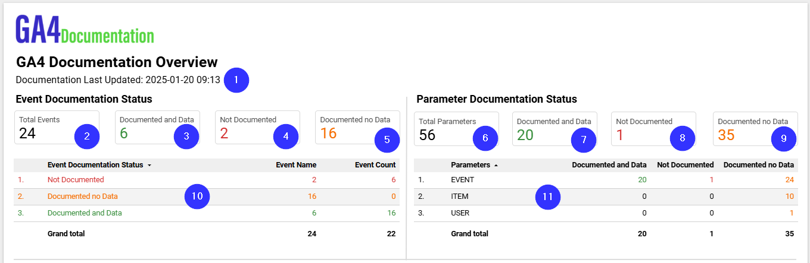
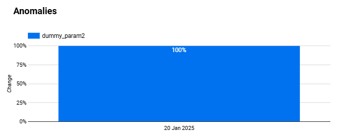
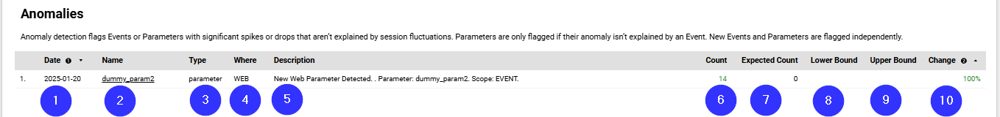
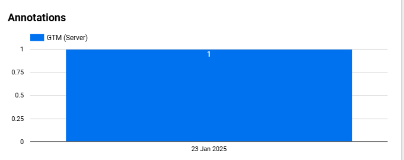

# GA4 Documentation Overview

This section contains information about **Fields** used on **GA4 Documentation Overview page**.

### Things to be aware of
Sometimes Looker Studio adds **Date Range Dimension** to charts by "itself". Date Range Dimensions are specified when to use.

| Number  | Field | Data Type | Filter On This Chart | Data Source |
| ------------- | ------------- | ------------- | ------------- | ------------- |
| 1 | Event Documentation Last Updated \[Calc\] | Metric |  | ga4_documentation_events_and_documentation_status |
| 2 | event_name | Metric |  | ga4_documentation_events_and_documentation_status |
| 3 | event_documentation_status | Metric | Documented Events and Data | ga4_documentation_events_and_documentation_status |
| 4 | event_documentation_status | Metric | Events not Documented | ga4_documentation_events_and_documentation_status |
| 5 | event_documentation_status | Metric | Documented Events no Data | ga4_documentation_events_and_documentation_status |
| 6 | Parameter Count Total \[Calc\] | Metric |  | ga4_documentation_parameters_and_documentation_status |
| 7 | Parameter Count Documented and Data \[Calc\] | Metric |  | ga4_documentation_parameters_and_documentation_status |
| 8 | Parameter Count Not Documented \[Calc\] | Metric |  | ga4_documentation_parameters_and_documentation_status |
| 9 | Parameter Count Documented no Data \[Calc\] | Metric |  | ga4_documentation_parameters_and_documentation_status |
| 10 | <ul><li>event_documentation_status </li><li> event_documentation_status </li><li> event_count_total </li></ul> | <ul><li> Text </li><li> Metric </li><li> Metric |  | ga4_documentation_events_and_documentation_status |
| 11 | <ul><li>parameter_scope </li><li> Parameter Count Documented and Data \[Calc\] </li><li> Parameter Count Not Documented \[Calc\] </li><li> Parameter Count Documented no Data \[Calc\]</li></ul> | <ul><li>Text </li><li> Metric </li><li> Metric </li><li> Metric</li></ul> |   | ga4_documentation_parameters_and_documentation_status |

## Anomalies

* **Data Source:** ga4_documentation_anomaly_detection

### Anomaly Chart

| Dimension | Break Down Dimension | Metric | Sort |
| ------------- | ------------- | ------------- | ------------- |
| event_date | event_or_parameter_name | net_change_percentage (Average) | <ul><li>event_date (asc) </li><li> Record Count (desc) </li></ul> |

### Anomaly Table

| Number  | Field | Data Type |
| ------------- | ------------- | ------------- |
| 1 | event_date | Date |
| 2 | Event or Parameter URL \[Calc\] | Hyperlink |
| 3 | event_or_parameter_type | Text |
| 4 | platform | Text | 
| 5 | anomaly_description | Text | 
| 6 | actual_count | Metric (Sum) | 
| 7 | expected_count | Metric (Sum) | 
| 8 | lower_bound | Metric (Sum) | 
| 9 | upper_bound | Metric (Sum) | 
| 10 | net_change_percentage | Metric (Sum) | 

## Annotations

* **Data Source:** ga4_documentation_annotations

| Date Range Dimension  | Dimension | Break Down Dimension | Metric | Sort |
| ------------- | ------------- | ------------- | ------------- | ------------- |
| annotation_time | annotation_time | annotation_category | Record Count | <ul><li>annotation_time (asc) </li><li> Record Count (desc) </li></ul> |
