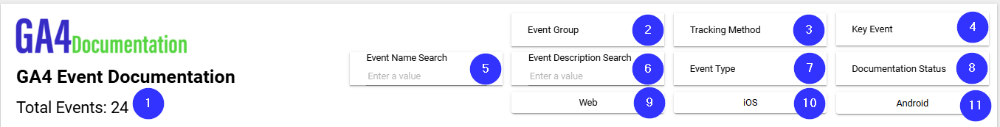

# GA4 Event Documentation
This section contains information about **Fields** used on **GA4 Event Documentation page**.

### Things to be aware of
Sometimes Looker Studio adds **Date Range Dimension** to charts by "itself". Date Range Dimensions are specified when they should be used.

* **Data Source:** ga4_documentation_events_and_documentation_status

| Number  | Field | Data Type | Field Type |
| ------------- | ------------- | ------------- | ------------- |
| 1 | Total Events \[Calc\] | Text | Metric |  |
| 2 | event_group | Text | Control Field |
| 3 | event_method | Text | Control Field |
| 4 | key_event | Boolean | Control Field |
| 5 | Event Name Search |  | Control Field |
| 6 | Event Description Search |  | Control Field |
| 7 | event_type | Text | Control Field | 
| 8 | event_documentation_status | Text | Control Field |
| 9 | platform_web | Boolean | Control Field |
| 10 | platform_ios | Boolean | Control Field | 
| 11 | platform_android | Boolean | Control Field | 

* **Data Source:** ga4_documentation_events_and_documentation_status

| Number  | Field | Data Type | Field Type |
| ------------- | ------------- | ------------- | ------------- |
| 1 | event_group | Text | Dimension | 
| 2 | Event Name URL \[Calc\] | Hyperlink | Dimension |
| 3 | platform_web_checkmark \[Calc\] | Text | Dimension |
| 4 | platform_ios_checkmark \[Calc\] | Text | Dimension |
| 5 | platform_android_checkmark \[Calc\] | Text | Dimension |
| 6 | key_event_checkmark \[Calc\] | Text | Dimension |
| 7 | event_description | Text | Dimension |
| 8 | Event Last Seen Days \[Calc\] | Text | Dimension |
| 9 | event_count_total | Number | Metric |
