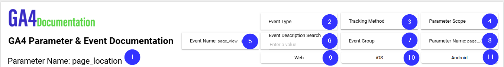

# GA4 Parameter & Event Documentation
This section contains information about **Fields** used on **Parameter & Event Documentation**.

### Things to be aware of
Sometimes Looker Studio adds **Date Range Dimension** to charts by "itself". Date Range Dimensions are specified when to use.

| Number  | Field | Data Type | Field Type | Data Source |
| ------------- | ------------- | ------------- | ------------- | ------------- |
| 1 | Parameter Name Label \[Calc\] | Text | Metric | ga4_documentation_parameters_and_documentation_status |
| 2 | event_type | Text | Control Field | ga4_documentation_events_and_documentation_status |
| 3 | event_method | Text | Control Field | ga4_documentation_events_and_documentation_status |
| 4 | parameter_scope | Text | Control Field | ga4_documentation_parameters_and_documentation_status |
| 5 | event_name | Text | Control Field | ga4_documentation_parameters_and_documentation_status |
| 6 | Event Description Search | | Control Field | ga4_documentation_events_and_documentation_status |
| 7 | event_group | Text | Control Field | ga4_documentation_events_and_documentation_status |
| 8 | parameter_name | Text | Control Field | ga4_documentation_parameters_and_documentation_status |
| 9 | platform_web | Boolean | Control Field | ga4_documentation_parameters_and_documentation_status |
| 10 | platform_ios | Boolean | Control Field | ga4_documentation_parameters_and_documentation_status |
| 11 | platform_android | Boolean | Control Field | ga4_documentation_parameters_and_documentation_status |

* **Data Source:** ga4_documentation_parameters_and_documentation_status

| Number  | Field | Data Type | Field Type |
| ------------- | ------------- | ------------- | ------------- |
| 1 | parameter_display_name | Text | Dimension |
| 2 | parameter_scope | Text | Dimension |
| 3 | parameter_type | Text | Dimension |
| 4 | parameter_example_value | Text | Dimension | 
| 5 | ga4_global_parameter_checkmark \[Calc\] | Text | Dimension |
| 6 | platform_web_checkmark \[Calc\] | Text | Dimension |
| 7 | platform_ios_checkmark \[Calc\] | Text | Dimension |
| 8 | platform_android_checkmark \[Calc\] | Text | Dimension |
| 9 | parameter_first_seen_date_total | Date | Dimension |
| 10 | Parameter Last Seen Days \[Calc\] | Text | Metric |
| 11 | parameter_count_total | Number | Metric |
| 12 | parameter_count_web | Number | Metric |
| 13 | parameter_count_ios | Number | Metric |
| 14 | parameter_count_android | Number | Metric |
| 15 | parameter_group | Text | Dimension |
| 16 | parameter_documentation_status | Text | Dimension |
| 17 | parameter_description | Text | Dimension |
| 18 | parameter_gtm_comment | Text | Dimension |

* **Blended Data Source:** GA4 Event & Parameter Blend

| Number  | Field | Data Type | Field Type |
| ------------- | ------------- | ------------- | ------------- |
| 1 | event_group | Text | Dimension |
| 2 | Event Name URL \[Calc\] | Hyperlink | Dimension |
| 3 | platform_web_checkmark \[Calc\] | Text | Dimension |
| 4 | platform_ios_checkmark \[Calc\] | Text | Dimension | 
| 5 | platform_android_checkmark \[Calc\] | Text | Dimension | 
| 6 | event_description | Text | Dimension |
| 7 | Event Last Seen Days \[Calc\] | Text | Dimension |
| 8 | event_count_total | Number | Metric |

