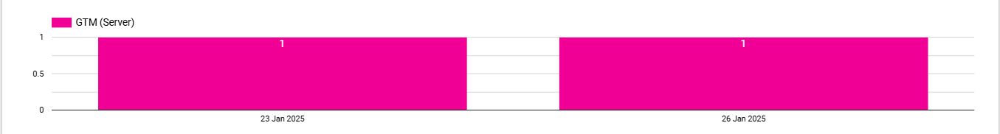
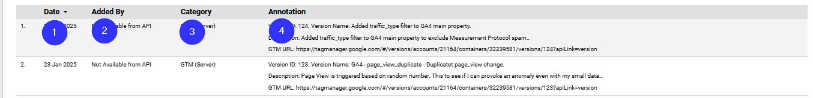

# Annotations

* **Data Source:** ga4_documentation_annotations

| Number  | Field | Data Type | Field Type |
| ------------- | ------------- | ------------- | ------------- |
| 1 | Search Added By | Text | Control Field |
| 2 | Annotation Search | Text | Control Field |
| 3 | annotation_category | Text | Control Field |
| 4 | Date Picker |  |  |

* **Data Source:** ga4_documentation_annotations

| Number  | Field | Data Type | Field Type |
| ------------- | ------------- | ------------- | ------------- |
| 1 | annotation_time | Date | Dimension |
| 2 | annotation_time | Date | Dimension |
| 3 | annotation_category | Text | Dimension |
| 4 | Record Count | Number | Metric |

* **Data Source:** ga4_documentation_annotations

| Number  | Field | Data Type | Field Type |
| ------------- | ------------- | ------------- | ------------- |
| 1 | annotation_time | Date | Dimension |
| 2 | annotation_added_by_email | Text | Dimension |
| 3 | annotation_category | Text | Dimension |
| 4 | Annotation \[Calc\] | Text | Dimension |
