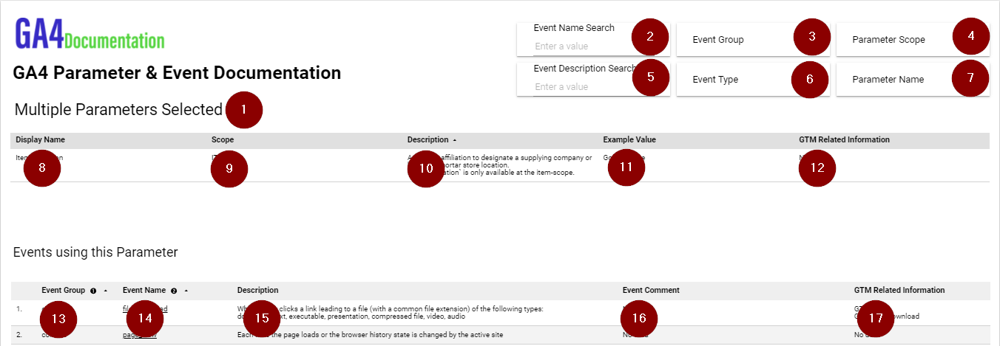

# Looker Studio - Basic - Using Google Sheet as Data Source
Documentation for creating basic Looker Studio report for presenting Event & Parameter Documentation without Documentation Status, in addition to Annotations. 
Google Sheet will be used as Data Source.

* Make a copy of the [**Looker Studio GA4 Basic Documentation report**](https://lookerstudio.google.com/reporting/43387b12-cfe6-43ba-8e0c-afcf1a46a0f8/page/p_nkztye53cd) 
  * If you are a consultant and are doing the documentation on behalf of a client, it's recommended to copy Looker Studio with an email belonging to the clients organization. This way ownership to Looker Studio can be transferred within the clients organization.
* **Add the following Google Sheet Worksheet Data Sources to Looker Studio:**
  1. [ParameterDataSource](#data-source-parameterdatasource)
  2. [EventDataSource](#data-source-eventdatasource)
  3. [EventImagesDataSource](#data-source-eventimagesdatasource)
  4. [AnnotationsDataSource](#data-source-annotationsdatasource)

## Generate Google Sheet Data Source data
At the top of the sheet, you will find a custom menu called "**📈 GA4 Documentation**".

* **Go to the menu:**
  * Use Sheet as Data Source -> Write Events & Parameters to Data Source Sheets

## Calculated Fields
The solution contains several **Calculated Fields**. They are all documented below.

It's recommended to add the Calculated Fields to the Data Source _before_ you click on the **Finished** button.

## Data Source: ParameterDataSource
Make the following adjustment to the data source if the **Calculated Fields** aren't working correctly/are missing.

### Parameters
#### Parameter Name Search
Create **Parameter Name Search** parameter.

* **Parameter name:** Parameter Name Search
* **Parameter ID:** parameter_name_search
* **Data Type:** Text
* **Permitted values:** Any value

#### Parameter Description Search
Create **Parameter Description Search** parameter.

* **Parameter name:** Parameter Description Search
* **Parameter ID:** parameter_description_search
* **Data Type:** Text
* **Permitted values:** Any value

### Calculated Fields
#### Event Name Label \[Calc\]
This becomes a metric.

* **Field Name:** Event Name Label \[Calc\]
* **Field ID:** event_name_label_calc

**Formula:**
```javascript
IF(COUNT_DISTINCT(Event Name)>1,"Multiple Event Names Selected",CONCAT("Event Name: ",MAX(Event Name)))
```

#### Parameter Name Label \[Calc\]
This becomes a metric.

* **Field Name:** Parameter Name Label \[Calc\]
* **Field ID:** parameter_name_label_calc

**Formula:**
```javascript
IF(COUNT_DISTINCT(Parameter Name)>1,"Multiple Parameters Selected",CONCAT("Parameter Name: ",MAX(Parameter Name)))
```

#### Total Parameters \[Calc\]
This becomes a metric.

* **Field Name:** Total Parameters \[Calc\]
* **Field ID:** total_parameters_calc

**Formula:**
```javascript
CONCAT('Total Parameters: ',COUNT_DISTINCT(Parameter Name))
```

#### Parameter Description Search \[Calc\]

* **Field Name:** Parameter Description Search \[Calc\]
* **Field ID:** parameter_description_search_calc

**Formula:**
```javascript
CONTAINS_TEXT(LOWER(Parameter Description), LOWER(Parameter Description Search))
```

#### Parameter Name Search \[Calc\]

* **Field Name:** Parameter Name Search \[Calc\]
* **Field ID:** parameter_name_search_calc

**Formula:**
```javascript
CONTAINS_TEXT(LOWER(Parameter Name), LOWER(Parameter Name Search))
```

#### Parameter Name URL \[Calc\]
Makes a **URL** based on **Parameter Name**. Click on Parameter Name will lead the user to a report showing Event Name(s) for this Parameter.

The URL must be edited to match your Looker Studio URLs.

* **Field name:** Parameter Name URL \[Calc\]
* **Field ID:** parameter_name_url_calc

**Formula:**
```javascript
HYPERLINK(CONCAT("https://lookerstudio.google.com/u/0/reporting/XXX/page/p_1ads1jvted?params=%7B%22df69%22:%22include%25EE%2580%25800%25EE%2580%2580IN%25EE%2580%2580",Parameter Scope,"%22,%22df73%22:%22include%25EE%2580%25800%25EE%2580%2580IN%25EE%2580%2580",Parameter Name,"%22%7D"),Parameter Name)
```
##### How to create the URL
Replace the **XXX** part of URL in the formula above with the **ID** found in YOUR Looker Studio URL.
If that doesn't work, this is how to recreate the URL from scratch:

1. Navigate to the **Parameter & Event Documentation** report
2. **Parameter Scope** filter: Select a single Scope (ex. **EVENT**)
3. **Parameter Name** filter: Select a single Parameter (ex. **file_extension**)
4. Copy the URL
5. Find the **Parameter Scope** in the URL, ex. **EVENT**. Replace **EVENT** with **Parameter Scope** as shown in the **Formula** above.
6. Find the **Parameter Name** in the URL, ex. **file_extension**. Replace **file_extension** with **Parameter Name** as shown in the **Formula** above.

If you want to learn more about creating custom URL links with Calculated Field, here is a video about the subject:
* [https://www.youtube.com/watch?v=fGBsjgjjYWg](https://www.youtube.com/watch?v=fGBsjgjjYWg)

## Data Source: EventDataSource
Make the following adjustment to the data source if the **Calculated Fields** aren't working correctly/are missing.

### Parameters
#### Event Name Search
Create **Event Name Search** parameter.

* **Parameter name:** Event Name Search
* **Parameter ID:** event_name_search
* **Data Type:** Text
* **Permitted values:** Any value

#### Event Description Search
Create **Event Description Search** parameter.

* **Parameter name:** Event Description Search
* **Parameter ID:** event_description_search
* **Data Type:** Text
* **Permitted values:** Any value

### Calculated Fields
#### Total Events \[Calc\]
* **Field name:** Total Events \[Calc\]
* **Field ID:** total_events_calc

**Formula:**
```javascript
CONCAT('Total Events: ', COUNT_DISTINCT(Event Name))
```

#### Event Description Search \[Calc\]
* **Field name:** Event Description Search \[Calc\]
* **Field ID:** event_description_search_calc

**Formula:**
```javascript
CONTAINS_TEXT(LOWER(Event Description), LOWER(Event Description Search))
```

#### Event Name Search \[Calc\]
* **Field name:** Event Name Search \[Calc\]
* **Field ID:** event_name_search_calc

**Formula:**
```javascript
CONTAINS_TEXT(LOWER(Event Name), LOWER(Event Name Search))
```

#### Event Android App Bool \[Calc\]
* **Field name:** Event Android App Bool \[Calc\]
* **Field id:** event_android_app_bool_calc

**Formula:**
```javascript
CASE WHEN Event Android App = 'TRUE' THEN true ELSE false END
```

#### Event iOS App Bool \[Calc\]
* **Field name:** Event iOS App Bool \[Calc\]
* **Field id:** event_ios_app_bool_calc

**Formula:**
```javascript
CASE WHEN Event iOS App = 'TRUE' THEN true ELSE false END
```

#### Event Website Bool \[Calc\]
* **Field name:** Event Website Bool \[Calc\]
* **Field id:** event_website_bool_calc

**Formula:**
```javascript
CASE WHEN Event Website = 'TRUE' THEN true ELSE false END
```

#### Event Name URL \[Calc\]
Makes a **URL** based on **Event Name**. Click on Event Name will lead the user to a report showing parameters (Dimensions & Metrics) for this Event Name.

The URL must be edited to match your Looker Studio URLs.

* **Field name:** Event Name URL \[Calc\]
* **Field ID:** event_name_url_calc

**Formula:**
```javascript
HYPERLINK(CONCAT("https://lookerstudio.google.com/u/0/reporting/XXX/page/p_nm474cc5cd?params=%7B%22df62%22:%22include%25EE%2580%25800%25EE%2580%2580IN%25EE%2580%2580FALSE%22,%22df63%22:%22include%25EE%2580%25800%25EE%2580%2580IN%25EE%2580%2580",Event Name,"%22%7D"),Event Name)
```
##### How to create the URL
Replace the **XXX** part of URL in the formula above with the **ID** found in YOUR Looker Studio URL.
If that doesn't work, this is how to recreate the URL from scratch:

1. Navigate to the **Event & Parameter Documentation** report
2. **GA4 Config Parameter** filter: **FALSE** (only)
3. **Event Name** filter: Select a single Event Name (ex. **click**)
5. Copy the URL
6. Find the **Event Name** in the URL, ex. **click**. Replace **click** with **Event Name** as shown in the **Formula** above.

If you want to learn more about creating custom URL links with Calculated Field, here is a video about the subject:
* [https://www.youtube.com/watch?v=fGBsjgjjYWg](https://www.youtube.com/watch?v=fGBsjgjjYWg)

## Data Source: EventImagesDataSource
Make the following adjustment to the data source if the Calculated Fields aren't working correctly.

### Calculated Fields

#### Event Image \[Calc\]
* **Field name:** Event Image \[Calc\]
* **Field id:** event_image_calc

**Formula:**
```javascript
HYPERLINK(Event Image Documentation URL,IMAGE(Event Image Documentation URL))
```

## Data Source: AnnotationsDataSource
Make the following adjustment to the data source if the **Calculated Fields** aren't working correctly.

### Parameters
#### Search Added By
Create **Search Added By** parameter.

* **Parameter name:** Search Added By
* **Parameter ID:** search_added_by
* **Data Type:** Text
* **Permitted values:** Any value

#### Search Annotations
Create **Search Annotations** parameter.

* **Parameter name:** Search Annotations
* **Parameter ID:** search_annotations
* **Data Type:** Text
* **Permitted values:** Any value

### Calculated Fields
#### Added By Search \[Calc\]
* **Field name:** Added By Search \[Calc\]
* **Field id:** added_by_search_calc

**Formula:**
```javascript
CONTAINS_TEXT(LOWER(Annotation Added By), LOWER(Search Added By))
```

#### Annotation Search \[Calc\]
* **Field name:** Annotation Search \[Calc\]
* **Field id:** annotation_search_calc

**Formula:**
```javascript
CONTAINS_TEXT(LOWER(Annotation), LOWER(Search Annotations))
```
## Looker Studio Fields Placement and Settings
This section contains information about **Fields** used in Looker Studio (not all fields available are used).

### Things to be aware of
Sometimes Looker Studio adds **Date Range Dimension** to charts by "itself". Date Range Dimensions are only used in the **Annotations page**, not in other pages.

### GA4 Event Documentation


| Number  | Field | Data Type | Field Type | Data Source |
| ------------- | ------------- | ------------- | ------------- | ------------- |
| 1 | Total Events \[Calc\] | Text | Metric | EventDataSource |
| 2 | Event Group | Text | Control Field | EventDataSource |
| 3 | Event Method | Text | Control Field | EventDataSource |
| 4 | Key Event | Boolean | Control Field | EventDataSource |
| 5 | Event Name Search |  | Control Field | EventDataSource |
| 6 | Event Description Search |  | Control Field | EventDataSource |
| 7 | Event Type | Text | Control Field | EventDataSource |
| 8 | Event Website Bool \[Calc\] | Boolean | Control Field | EventDataSource |
| 9 | Event iOS App Bool \[Calc\] | Boolean | Control Field | EventDataSource |
| 10 | Event Android App Bool \[Calc\] | Boolean | Control Field | EventDataSource |
| 11 | Event Group | Text | Dimension | EventDataSource |
| 12 | Event Name URL \[Calc\] | Hyperlink | Dimension | EventDataSource |
| 13 | Event Type | Text | Dimension | EventDataSource |
| 14 | Event Method | Text | Dimension | EventDataSource |
| 15 | Key Event | Text | Dimension | EventDataSource |
| 16 | Event Description | Text | Dimension | EventDataSource |

### GA4 Parameter Documentation


| Number  | Field | Data Type | Field Type | Data Source |
| ------------- | ------------- | ------------- | ------------- | ------------- |
| 1 | Total Parameters \[Calc\] | Text | Metric | ParameterDataSource |
| 2 | Event Name Label \[Calc\] | Text | Metric | ParameterDataSource |
| 3 | GA4 Config Parameter | Boolean | Control Field | ParameterDataSource |
| 4 | Parameter Group | Text | Control Field | ParameterDataSource |
| 5 | Parameter Type | Text | Control Field | ParameterDataSource |
| 6 | Parameter Name Search | | Control Field | ParameterDataSource |
| 7 | Parameter Description Search | | Control Field | ParameterDataSource |
| 8 | Parameter Scope | Text | Control Field | ParameterDataSource |
| 9 | Event Name | Text | Control Field | ParameterDataSource |
| 10 | Parameter Group | Text | Dimension | ParameterDataSource |
| 11 | Parameter Display Name | Text | Dimension | ParameterDataSource |
| 12 | Parameter Name URL \[Calc\] | Hyperlink | Dimension | ParameterDataSource |
| 13 | Parameter Scope | Text | Dimension | ParameterDataSource |
| 14 | Parameter Type | Text | Dimension | ParameterDataSource |
| 15 | Parameter Format | Text | Dimension | ParameterDataSource |
| 16 | Parameter NPA | Boolean | Dimension | ParameterDataSource |
| 17 | Parameter Description | Text | Dimension | ParameterDataSource |
| 18 | Parameter GTM Comment | Text | Dimension | ParameterDataSource |

### GA4 Event & Parameter Documentation


| Number  | Field | Data Type | Field Type | Data Source |
| ------------- | ------------- | ------------- | ------------- | ------------- |
| 1 | Total Parameters \[Calc\] | Text | Metric | ParameterDataSource |
| 2 | Event Name Label \[Calc\] | Text | Metric | ParameterDataSource |
| 3 | GA4 Config Parameter | Boolean | Control Field | ParameterDataSource |
| 4 | Parameter Group | Text | Control Field | ParameterDataSource |
| 5 | Parameter Type | Text | Control Field | ParameterDataSource |
| 6 | Parameter Name Search | | Control Field | ParameterDataSource |
| 7 | Parameter Description Search | | Control Field | ParameterDataSource |
| 8 | Parameter Scope | Text | Control Field | ParameterDataSource |
| 9 | Event Name | Text | Control Field | EventDataSource |
| 10 | Event Description | Text | Dimension | EventDataSource |
| 11 | Event Comment | Text | Dimension | EventDataSource |
| 12 | Event GTM Comment | Text | Dimension | EventDataSource |
| 13 | Key Event | Text | Dimension | EventDataSource |
| 14 | Parameter Group | Text | Dimension | ParameterDataSource |
| 15 | Parameter Display Name | Text | Dimension | ParameterDataSource |
| 16 | Parameter Name URL \[Calc\] | Hyperlink | Dimension | ParameterDataSource |
| 17 | Parameter Scope | Text | Dimension | ParameterDataSource |
| 18 | Parameter Type | Text | Dimension | ParameterDataSource |
| 19 | Parameter Format | Text | Dimension | ParameterDataSource |
| 20 | Parameter NPA | Boolean | Dimension | ParameterDataSource |
| 21 | Parameter Description | Text | Dimension | ParameterDataSource |
| 22 | Parameter GTM Comment | Text | Dimension | ParameterDataSource |

#### Image Documentation for Events


| Number  | Field | Data Type | Field Type | Data Source |
| ------------- | ------------- | ------------- | ------------- | ------------- |
| 1 | event_name | Text | Dimension | GA4 Image and Event Name Blend |
| 2 | Event Image \[Calc\] | Image Link | Dimension | GA4 Image and Event Name Blend |

### GA4 Parameter & Event Documentation


| Number  | Field | Data Type | Field Type | Data Source |
| ------------- | ------------- | ------------- | ------------- |------------- |
| 1 | Parameter Name Label \[Calc\] | Text | Metric | ParameterDataSource |
| 2 | Event Name Search | | Control Field | ParameterDataSource |
| 3 | Event Group | Text | Control Field | EventDataSource |
| 4 | Parameter Scope | Text | Control Field | ParameterDataSource |
| 5 | Event Description Search | | Control Field | EventDataSource |
| 6 | Event Type | Text | Control Field | EventDataSource |
| 7 | Parameter Name | Text | Control Field | ParameterDataSource |
| 8 | Parameter Display Name | Text | Dimension | ParameterDataSource |
| 9 | Parameter Scope | Text | Dimension | ParameterDataSource |
| 10 | Parameter Description | Text | Dimension | ParameterDataSource |
| 11 | Parameter Example Value | Text | Dimension | ParameterDataSource |
| 12 | Parameter GTM Comment | Text | Dimension | ParameterDataSource |
| 13 | Event Group | Text | Dimension | GA4 Event & Parameter Blend |
| 14 | Event Name URL \[Calc\] | Hyperlink | Dimension | GA4 Event & Parameter Blend |
| 15 | Event Description | Text | Dimension | GA4 Event & Parameter Blend |
| 16 | Event Comment | Text | Dimension | GA4 Event & Parameter Blend |
| 17 | Event GTM Comment | Text | Dimension | GA4 Event & Parameter Blend |
