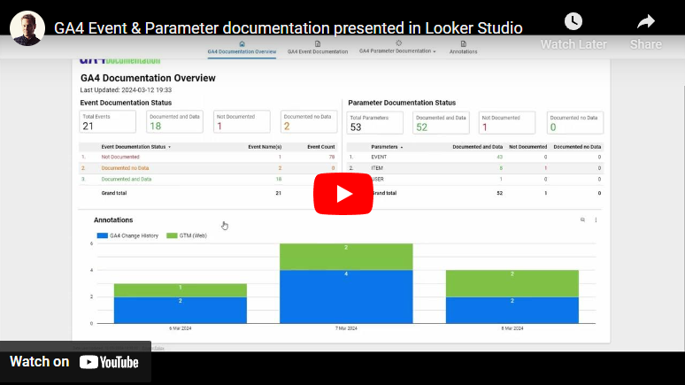

# Looker Studio - Overview
Looker Studio is used for presenting Event & Parameter Documentation, in addition to Annotations.

Looker Studio comes in 2 different versions; [**Advanced**](Advanced) and [**Basic**](Basic).
1. Video below demonstrates the **Looker Studio Advanced version**
2. Demo of [**Looker Studio Basic version**](https://lookerstudio.google.com/reporting/43387b12-cfe6-43ba-8e0c-afcf1a46a0f8/page/p_nkztye53cd)

| Functionality  | Advanced | Basic |
| ------------- | ------------- | ------------- |
| Data Source | BigQuery | Google Sheet |
| Event & Parameter Documentation Overview | ✔ | :x: |
| Event Search & Filtering | ✔ | ✔ |
| Parameter Search & Filtering | ✔ | ✔ |
| See relationship between Events & Parameters | ✔ | ✔ |
| See relationship between Parameters & Events | ✔ | ✔ |
| Differentiate between global parameters (GA4 Config Parameters) and Event specific parameters | ✔ | ✔ |
| Identify if documentation is aligned with data collected (are documentation or data collection broken) | ✔ | :x: |
| Identify undocumented Events collecting data, broken down on Web, iOS and Android | ✔ | :x: |
| Identify undocumented Parameters collecting data, broken down on Scope, Events, Web, iOS and Android | ✔ | :x: |
| Identify documented Events that isn't collecting data, broken down on Web, iOS and Android | ✔ | :x: |
| Identify documented Parameters that isn't collecting data, broken down on Events + Web, iOS and Android | ✔ | :x: |
| Event Count broken down on Web, iOS and Android | ✔ | :x: |
| Parameter Count broken down on Scope, Events, Web, iOS and Android | ✔ | :x: |
| Days since Event was _last seen_, broken down on Web, iOS and Android | ✔ | :x: |
| Date when Event was _first seen_, broken down on Web, iOS and Android | ✔ | :x: |
| Days since Parameter was _last seen_, broken down on Events + Web, iOS and Android | ✔ | :x: |
| Date when Parameter was _first seen_, broken down on Scope, Web, iOS and Android | ✔ | :x: |
| Anomaly detection for Events broken down on Web, iOS and Android | ✔ | :x: |
| Anomaly detection for Parameters broken down on Scope, Events, Web, iOS and Android | ✔ | :x: |
| Google Cloud costs may occur | ✔ | :x: |
| Annotation report | ✔ | ✔ |

<table>
  <tr>
    <td> </td>
    <td> </td>
   </tr> 
    <tr>
    <td> </td>
    <td> </td>
   </tr> 
</table>
