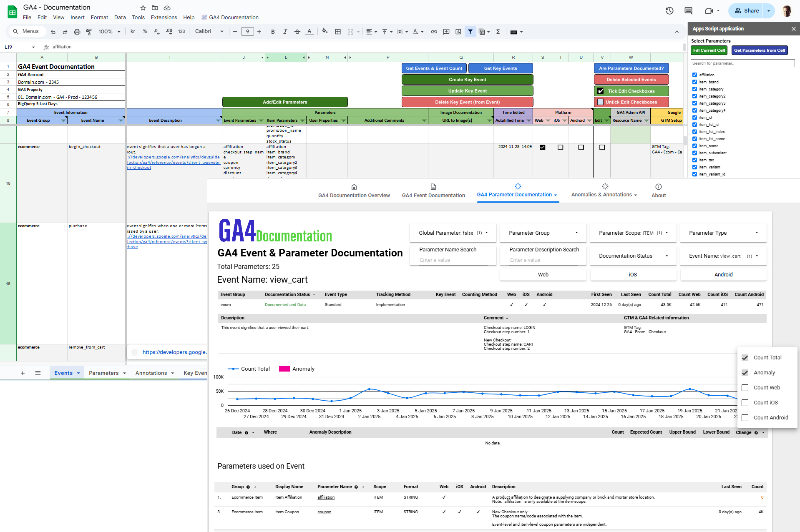
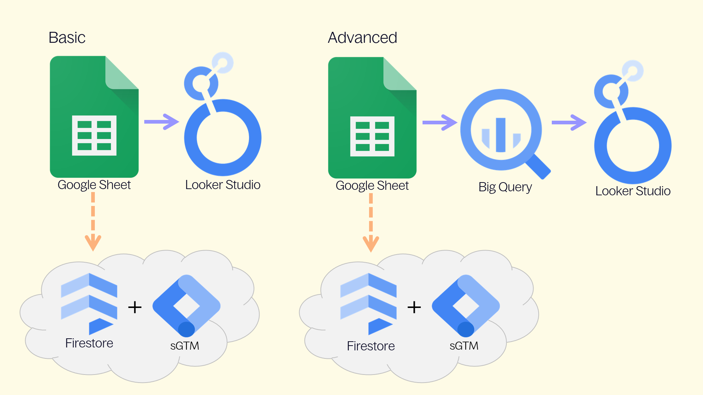

# GA4 Documentation & Administration Solution

This solution simplifies the documentation and management of **Events**, **Key Events**, and **Parameters** (Dimensions & Metrics) for **Google Analytics 4 (GA4)**.

* [3.0 is latest version](../../releases/tag/3.0).

### Key Components
- **[Google Sheet](Google-Sheet):** Central platform for documenting Events, Parameters, and Annotations. 
  - Integrated with APIs to allow bulk operations (create/edit/delete) for Custom Dimensions, Metrics, and Key Events.
  - Integrated with BigQuery for easier identification of platforms, events & parameters.
- **[Looker Studio](Looker-Studio):** Visualization tool with two versions:
  - **[Basic:](Looker-Studio/Basic)** Uses Google Sheets as a data source.
  - **[Advanced:](Looker-Studio/Advanced)** Uses BigQuery, allowing documentation to align directly with GA4 data.
    - Includes **Anomaly Detection** to identify data collection issues like tracking inconsistencies, or flagging new events and parameters discovered.

### Annotations
Annotations provide context to data changes and can be added manually in Google Sheet, or automatically generated through:
- GA4 Property Change History
- Google Tag Manager (GTM) Container Versions

### Additional Features
1. **[Documentation Sync with GA4 Data](BigQuery)** (BigQuery): Joins GA4 documentation with your data to help identify tracking and documentation misalignments.
	* **[Anomaly Detection:](BigQuery/Anomaly-Detection)** Flags spikes, drops, and new events/parameters that may signal tracking issues unrelated to traffic changes.
3. **[Event Export to Firestore:](Firestore)** Allows undocumented events to be flagged or blocked. Requires Server-side GTM for Event Group management.

---

### Overview of Functionality

1. **[Google Sheet](Google-Sheet):** Backbone for all documentation and management, supported by Apps Script for automation.
2. **[Looker Studio](Looker-Studio):** User-friendly platform for documentation sharing, with an Advanced version (BigQuery) to validate against GA4 data.
3. **[Firestore](Firestore):** Optional integration to flag or block undocumented events in GA4.

---

---

Solution by [**Eivind Savio**](https://www.savio.no/google-analytics/ga4-documentation-events-parameters-annotations) from [**Knowit Experience**](https://www.knowit.no/om-oss/experience/) (Oslo). Not officially supported by Knowit Experience.
