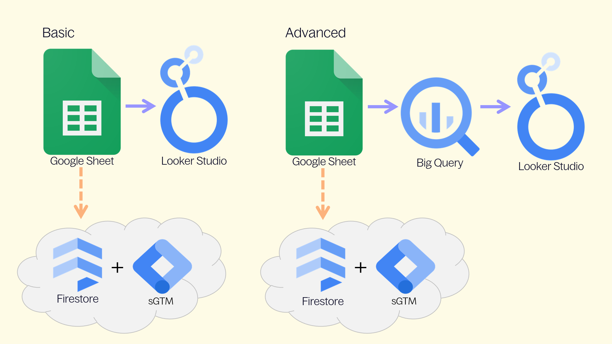

# GA4 Documentation & Administration Solution

This solution simplifies the documentation and management of **Events**, **Key Events**, **Parameters** (Dimensions & Metrics) & **Annotations** for **Google Analytics 4 (GA4)**.

## Upgrading

* [4.0 is latest version](../../releases/tag/v4.0).

## Setup

* [Setup instructions](Setup).

## Key Components

- **[Google Sheet](Setup/Google-Sheet):** Central platform for documenting Events, Parameters, and Annotations. 
  - Integrated with APIs to allow bulk operations (create/edit/delete) for Custom Dimensions, Metrics, and Key Events.
  - Integrated with BigQuery for easier identification of Platforms, Events & Parameters.
- **[Looker Studio](Setup/Looker-Studio):** Visualization tool with two versions:
  - **[Basic](Setup/Looker-Studio/Basic):** Uses Google Sheets as a data source.
  - **[Advanced](Setup/Looker-Studio/Advanced):** Uses [BigQuery](Setup/BigQuery), allowing documentation to align directly with GA4 data.
    - Includes **[Anomaly Detection](Setup/BigQuery/Anomaly-Detection)** to identify data collection issues like tracking inconsistencies, or flagging new events and parameters discovered.

## Annotations

Annotations provide context to data changes. They can be automatically generated through:
- GA4 Annotations
- GA4 Property Change History
- Google Tag Manager (GTM) Container Versions

You also have the option to create, edit or delete **GA4 Annotations** from the Google Sheet.

## Additional Features

* **[Event Export to Firestore:](Firestore)** Allows undocumented events to be flagged or blocked. Requires Server-side GTM for Event Group management.

---

---

Solution by [**Eivind Savio**](https://www.savio.no/google-analytics/ga4-documentation-events-parameters-annotations) from [**Knowit AI & Analytics**](https://www.knowit.no/) (Oslo, Norway). Not officially supported by Knowit.
