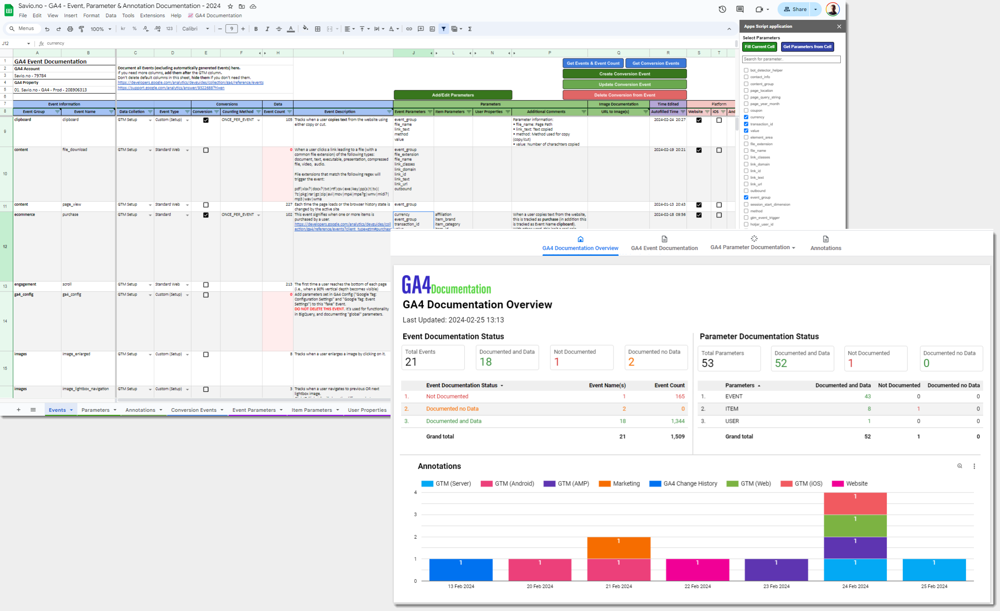

# GA4 Events, Parameters & Annotations documentation & administration solution
This is a solution that makes it easier to document and administrate **Events**, **Key Events**, **Parameters** (Dimensions & Metrics) for **Google Analytics 4 (GA4)**. 

[**Google Sheet**](Google-Sheet) is used for **doing the documentation**, and [**Looker Studio**](Looker-Studio) is used for **presenting the documentation**. Since the Google Sheet is integrated with several API's, you can (bulk) create/edit/delete Custom Dimensions & Metrics and Key Events. This means that you can document and administrate Custom Dimensions & Metrics and Key Events in the same operation.

It also makes it easier for "non-technical" people to understand what a particular **Event Name** is tracking, and what the different **Parameters** connected to the **Event Name** is tracking, by **presenting** the documentation in [**Looker Studio**](Looker-Studio). Looker Studio comes in **2 different versions**: **Basic** and **Advanced**. 

The **Basic** version is using the **Google Sheet as a Data Source**, while the **Advanced** version is using **BigQuery as a Data Source**. The BigQuery solution will join the GA4 documentation with your GA4 BigQuery data, making it easy to identify if the documentation is aligned with data collected in GA4.

The solution also includes [**Annotations**](Google-Sheet#annotations), which can help you understand changes to your data. Annotations can either be added manually, or automatically created from [**GA4 Property Change History**](https://developers.google.com/analytics/devguides/config/admin/v1/rest/v1beta/accounts/searchChangeHistoryEvents) or [**Google Tag Manager Container Versions**](https://developers.google.com/tag-platform/tag-manager/api/v2/reference/accounts/containers/versions).

**Overall functionality is listed below:**

1. [**Google Sheet**](Google-Sheet) using [**Apps Script**](Apps-Script) for easier documentation and administration of Events, Parameters and Annotations. Everything starts with this Google Sheet.
2. [**Looker Studio**](Looker-Studio) for presenting and sharing the documentation. The Advanced version using [**BigQuery**](BigQuery) will make it easier to identify if your documentation is aligned with the data you are collecting, or if the documentation or data collection is "broken".
3. **Export** of Event documentation to [**Firestore**](Firestore). This will make it possible to **block** or **flag** undocmented Events, in addition to adding **Event Group** from the Google Sheet Event documentation. This requires [**Server-side GTM**](https://developers.google.com/tag-platform/tag-manager/server-side).

This solution is made by [**Eivind Savio**](https://www.savio.no/google-analytics/ga4-documentation-events-parameters-annotations) from [**Knowit Experience**](https://www.knowit.no/om-oss/experience/) (Oslo). It is not officially supported by Knowit Experience.

## Intro to documentation
The documentation is divided into 5 separate parts:
1. [Google Sheet](Google-Sheet) (Everything starts with the Google Sheet)
2. [Apps Script](Apps-Script) (used in the Google Sheet)
3. [BigQuery](BigQuery) (for integrating the documentation with GA4 Data so you can understand if the documentation or tracking is broken)
4. [Looker Studio](Looker-Studio) (for presenting Events, Parameters and Annotations in a way that is easier to understand)
5. [Firestore](Firestore) (for flagging or blocking undocumented GA4 Events)
