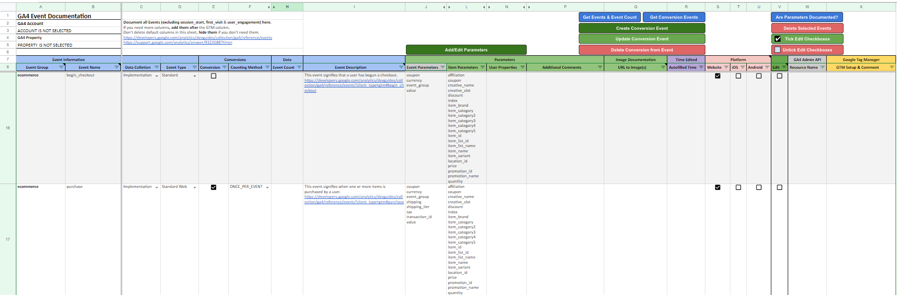
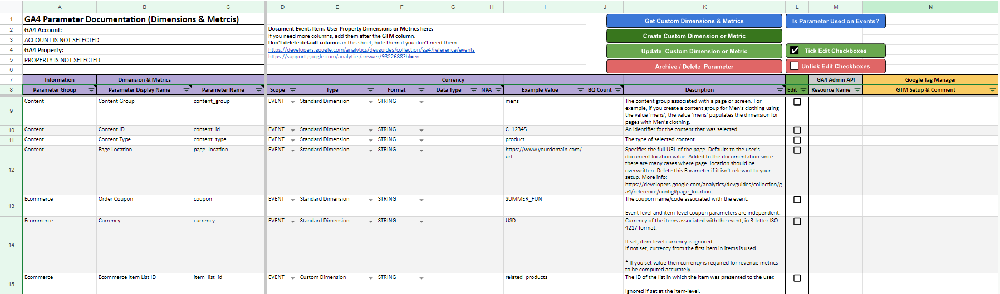
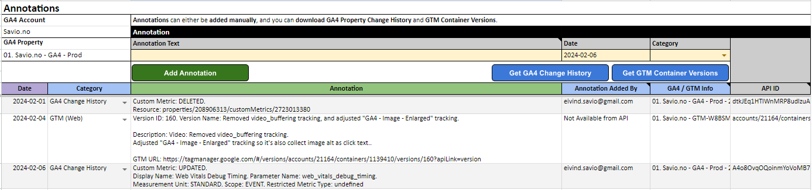

# GA4 Events, Parameters & Annotations documentation & administration solution
This is a solution that makes it easier to document and administrate **Events**, **Conversion Events**, **Parameters** (Dimensions & Metrics) for **Google Analytics 4 (GA4)**. 

[**Google Sheet**](#google-sheet-documentation) is used for **doing the documentation**, and [**Looker Studio**](Looker-Studio) is used for **presenting the documentation**. Since the Google Sheet is integrated with several API's, you can (bulk) create/edit/delete Custom Dimensions & Metrics and Conversion Events. This means that you can document and administrate Custom Dimensions & Metrics and Conversion Events in the same operation.

It also makes it easier for "non-technical" people to understand what a particular **event_name** is tracking, and what the different **parameters** connected to the **event_name** is tracking, by **presenting** the documentation in [**Looker Studio**](Looker-Studio). Looker Studio comes in **2 different versions**: **Basic** and **Advanced**. 

The **Basic** version is using the **Google Sheet as a Data Source**, while the **Advanced** version is using **BigQuery as a Data Source**. The BigQuery solution will join the GA4 documentation with your GA4 BigQuery data, making it easy to identify if the documentation is aligned with data collected in GA4.

The solution also includes [**Annotations**](#annotations), which can help you understand changes to your data. Annotations can either be added manually, or automatically created from [**GA4 Property Change History**](https://developers.google.com/analytics/devguides/config/admin/v1/rest/v1beta/accounts/searchChangeHistoryEvents) or [**Google Tag Manager Container Versions**](https://developers.google.com/tag-platform/tag-manager/api/v2/reference/accounts/containers/versions).

Overall functionality is listed below:

1. [**Google Sheet**](https://docs.google.com/spreadsheets/d/1j0xGxwdyeYTTbr2mgcIRr_BsVOhzn_tZEZsV_x50hg4/copy) using [**Apps Script**](Apps-Script) for easier documentation and administration of Events, Parameters and Annotations. Everything starts with this Google Sheet.
2. [**Looker Studio**](Looker-Studio) for presenting and sharing the documentation. The Advanced version using [**BigQuery**](BigQuery) will make it easy to identify if your documentation is aligned with the data you are collecting, or if the documentation or data collection is "broken".
3. **Export** of Event documentation to [**Firestore**](Firestore). This will make it possible to **block** or **flag** undocmented Events, in addition to adding **event_group** from the Google Sheet Event documentation. This requires [**Server-side GTM**](https://developers.google.com/tag-platform/tag-manager/server-side).

This solution is made by [**Eivind Savio**](https://www.savio.no) from [**Knowit Experience Oslo**](https://www.knowit.no/). It is not officially supported by Knowit Experience Oslo.

## Intro to documentation
The documentation is divided into 5 separate parts:
1. [Google Sheet](#google-sheet-documentation) (is documented on this page).
2. [Apps Script](Apps-Script) (used in this Google Sheet)
3. [BigQuery](BigQuery) (for integrating the documentation with GA4 Data so you can understand if the documentation is aligned with data collected)
4. [Looker Studio](Looker-Studio) (for presenting Events, Parameters and Annotations in a way that is easier to understand)
5. [Firestore](Firestore) (for flagging or blocking undocumented GA4 Events)

# Google Sheet documentation

## How to use the Google Sheet
* [**Make a copy of the Google Sheet**](https://docs.google.com/spreadsheets/d/1j0xGxwdyeYTTbr2mgcIRr_BsVOhzn_tZEZsV_x50hg4/copy)

* The Google Sheet comes prefilled with most common **GA4 Event Names** and **Parameters** (Dimensions / Metrics).
  * **Delete** Event Names and Parameters you don't need in your documentation.
* Go to [**Settings Sheet**](#settings) and input your settings.
  * You should at least fill out **GA4 Settings**, but it's highly recommended to fill out **BigQuery Settings** as well since some functionality only works with BigQuery.
* First, document all your [**Parameters**](#parameters) , then document your [**Events**](#events). How to do that is explained below.

## Sheets
| Sheet  | Comment |
| ------------- | ------------- |
| [Events](#events) | In this sheet you edit and document Events. |
| [Parameters](#parameters)  | In this sheet you edit and document Parameters (Standard Dimensions, Custom Dimensions, Standard Metrics, Custom Metrics). |
| [Annotations](#annotations)  | Annotations can be added manually, you can import GA4 Property Change History (if something is changed in the property, this is logged in the Change History), and you can import Google Tag Manager Container Versions (name & description).  |
| Conversion Events | Listing Events from the Events Sheet where the Event is marked as a Conversion Event. No functionality in this sheet. |
| Event Parameters | This Sheet is listing Parameters from the Parameters Sheet where the Scope of the Parameter is set to EVENT. No functionality in this sheet. |
| Item Parameters | This Sheet is listing Parameters from the Parameters Sheet where the Scope of the Parameter is set to ITEM. No functionality in this sheet. |
| User Properties | This Sheet is listing Parameters from the Parameters Sheet where the Scope of the Parameter is set to USER. No functionality in this sheet. |
| [Settings](#settings)  | Settings for Sheets functionality. |

## 📈 GA4 Documentation Menu
At the top of the sheet, you will find a custom menu called "**📈 GA4 Documentation**".

| Menu  | Description |
| ------------- | ------------- |
| BigQuery -> Export Event & Parameter Documentation | This is a manual export of Event & Parameter documentation. Only Events with mandatory columns filled out will be exported, and the same goes for Parameters. In addition, only Parameters added to a Event will be exported. |
| BigQuery -> Export Annotations | This is a manual export of Annotations from the Annontations Sheet. |
| Firestore -> Export Event Documentation | This is a manual export of Event & Parameter documentation to Firestore. |
| Use Sheet as Data Source -> Write Events & Parameters to Data Source Sheets | Writes Events & Parameter Documentation to some hidden Sheets using Apps Script in a format that Looker Studio can use as Data Source. |
| Check for Updates | Check if there are any updates to the solution. If there is an update, follow the instructions. |

## Events
Here you document your Events. The most common GA4 Event Names are prefilled and described. 

### Buttons in Event Sheet
All buttons will trigger an Apps Script function. If you are doing bulk editing where the GA4 Admin API is "in play", beware that there are [**Limits and Quotas on API Requests**](https://developers.google.com/analytics/devguides/config/admin/v1/quotas).

| Button  | Description |
| ------------- | ------------- |
| Add/Edit Parameters | This button is for adding/editing Parameters (Event, Item or User Scoped). If you want to add Item Parameters to an Event, select the corresponding **Item Parameters** cell, and click the **Add/Edit Parameters** button. In the popup, select the Parameters you want to add to the Event, and click **Fill Current Cell**. |
| Get Events & Event Count | Events & Event Count can either be downloaded from the **API**, or from **BigQuery**. Use the setting **Get GA4 Event & Parameters from** in the **Settings** Sheet to select API or BigQuery. Use BigQuery if you experience **(other)** issues, or if you want todays data included (**Streaming** export must be actived in GA4). |
| Get Conversion Events | This will download Conversion Events from GA4. If this/these Conversion Event(s) doesn't exist in the Event Sheet, they will be added after the last row in the Sheet. If the Event exist in the Sheet, corresponding row in **Resource Name** column will be highlighted green, and a Resource Name will be added. **Conversion** checkbox and **Counting Method** will not be updated, **unless** you tick the **Edit** checkbox. This is to prevent overriding existing documentation by accident. |
| Create Conversion Event | Select Event(s) (**Edit** checkbox) that you want make a Conversion Event. |
| Update Conversion Event | Select Conversion Event(s) (**Edit** checkbox) that you want to update. Updates you can do to a Conversion Event is to select either **ONCE_PER_EVENT** or **ONCE_PER_SESSION**. |
| Delete Conversion from Event | Select Conversion Event(s) (**Edit** checkbox) that you want to delete. This will delete / archive the Conversion Event in GA4. You will be prompted to verify that you want to delete these Conversion Events before the deletion happens.  |
| Are Parameters Documented? | Select Events (**Edit** checkbox) that you want to check. Event, Item & User Parameters for that/these Event(s) will be checked against the Parameter documentation. If undocumented Parameters in the Event Sheet is found, you will get the option to delete those Parameters from ALL Events. Bulk deletion is not a problem. |
| Delete Selected Events | All Events selected in the **Edit** column will be deleted (rows will be deleted). If the Event is also a **Conversion Event**, the Conversion Event in GA4 will also be deleted / archived. Be careful with bulk deletion. You will be prompted to verify that you want to delete this/these Event(s) before the deletion happens. |
| Tick Edit Checkboxes | This will **select ALL** checkboxes. |
| Untick Edit Checkboxes| This will **deselect ALL** checkboxes. |

### Columns in Event Sheet
The different columns in the Sheet are described below.

| Column Name  | Description |
| ------------- | ------------- |
| Event Group | Grouping Events together with a event_group parameter is a good thing to do. It can make it easier to understand your Events, and do queries in BigQuery. The Event Group parameter will also be used in the Firestore to Server-side GTM integration. How to group the Events is up to you. Event Group **must be filled out** if you are going to export the documentation to BigQuery. |
| Event Name | Type the **Event Name** here. If the Event Name is a **duplicate**, the cell will be highlighted with a red color. If the Event Name is written in a format that isn’t **snake_case**, input will be rejected. Enforcing **snake_case** can be turned off in the **Settings Sheet**. Event Name **must be filled out** if you are going to export the documentation to BigQuery. Automatically collected Events (first_visit, first_open, session_start and user_engagement) are excluded from the documentation. Also notice the "special" Event **ga4_config**. DO NOT DELETE this Event. This Event is for documenting global Parameters, and has some functionality in BigQuery. |
| Data Colletion | Select from a drop-down list how this Event is generated. This is just for your own documentation. |
| Event Type | Select from a drop-down list what kind of Event this is. This is just for your own documentation. |
| Conversion | Tick the **checkbox** if this Event is a **conversion**. |
| Counting Method | After you have ticked the **checkbox**, you can select if the conversion is **ONCE_PER_EVENT** or **ONCE_PER_SESSION**. |
| Event Count | If you click on the **Get Events & Event Count** button, Event Count will be written to this column. Event Count can either be downloaded from the **API** or **BigQuery**. |
| Event Description | Write a description for the Event here. Event Description **must be filled out** if you are going to export the documentation to BigQuery. |
| Event Parameters | Event Parameters are added here. Do not Edit cells manually, since this may break some functionality. Only add Parameters to a cell by using the Apps Script application, or copy + paste from another Event Parameter cell. |
| Item Parameters | Item Parameters are added here. Do not Edit cells manually, since this may break some functionality. Only add Parameters to a cell by using the Apps Script application, or copy + paste from another Item Parameter cell.  If Item Parameters aren't relevant for your documentation, just hide the Item Parameters column. |
| User Properties | User Scoped Parameters are added here. Do not Edit cells manually, since this may break some functionality. Only add Parameters to a cell by using the Apps Script application, or copy + paste from another User Property cell.  If User Properties aren't relevant for your documentation, just hide the User Properties column. |
| Additional Comments | Add Additional Comments here, ex. describing what Parameters are tracking specifically for this Event. |
| URL to Image(s) | Sometimes words can't describe the Event good enough, and you need image(s)/illustration(s) to document the Event. Paste URL(s) to images in this cell. Separate several image URLs with **new line** (line break).  Alt or Ctrl + Enter (**Windows**) or Cmd + Enter (**Mac**). See also [**Image Documentation**](#image-documentation). |
| Autofilled Time | If any cell is changed to the left of the **Autofilled Time** column, this column will be autofilled with the time the change was made. |
| Website / iOS / Android | If the Event is used on a Website, tick the Website **checkbox**, and vice versa for iOS/Android. If neither Website, iOS or Android is selected, the Event will not be exported to BigQuery. |
| Edit | Tick this checkbox for functionally related to that Event (see [Buttons in Event Sheet](#buttons-in-event-sheet)) |
| Resource Name | Resource Name ID will be added be added to this column if the Event is a Conversion Event in GA4 |
| GTM Setup & Comment | If you are using GTM/sGTM, add relevant information here. Ex. name of the Tag in GTM/sGTM. |

### Image Documentation
Sometimes words can't describe the Event good enough, and you need image(s)/illustration(s) to document the Event. Where to store those images is up to you, but if you are going to export the documentation to [**Looker Studio**](Looker-Studio) via [**BigQuery**](BigQuery), images needs to be publicly available.

#### Google Drive
If you are storing the images in **Google Drive**, store them in a folder with the settings **Anyone on the Internet with the link can view**.
* Select the image you want to add to the documentation, and click **Share**, and **Copy link**, and add that link to **URL to Image(s)** cell.
 * Since Google Drive image URL's doesn't work in Looker Studio, URLs will automatically be rewritten before stored in BigQuery.
 * Separate several image URLs with new line (line break). Alt or Ctrl + Enter (Windows) or Cmd + Enter (Mac). 

## Parameters
Description of the Parameters sheet.

### Buttons in Parameter Sheet
All buttons will trigger an Apps Script function.

| Button  | Description |
| ------------- | ------------- |
| Get Custom Dimensions & Metrics | If **API** is selected in **Settings** Sheet, Parameters (Custom Dimensions & Metrics) will be downloaded from GA4. If the Parameter exist in the Sheet, corresponding row in **Resource Name** column will be highlighted in green, and a Resource Name will be added. **Parameter Display Name** and **Description** will not be updated, **unless** you tick the **Edit** checkbox. This is to prevent overriding existing documentation by accident. If **BigQuery** is selected Parameters from BigQuery including a Parameter Count will be downloaded. Use the setting **Get GA4 Event & Parameters from** in the **Settings** Sheet to select **API** or **BigQuery**. If there is no match between Parameters in the Sheet and Parameters being downloaded, these Parameters will be added after the last row in the Sheet. |
| Greate Custom Dimension or Metric | Fill out necessary information for the Parameter, select the corresponding **checkbox** in the **Edit** column, and click the button. It's possible to bulk create Custom Dimensions or Metrics, but beware of the API quota. |
| Update  Custom Dimension or Metric | Fill out necessary information for the Parameter, select the corresponding **checkbox** in the **Edit** column, and click the button. It's possible to bulk update Custom Dimensions or Metrics, but beware of the API quota. It's not possible to **edit CURRENCY Custom Metrics** from the Sheet. |
| Archive / Delete  Parameter | Use this to **delete Custom Dimensions & Metrics**. Select the corresponding **checkbox** in the **Edit** column, and click the button. Bulk deletes are possible, but use that with caution. |
| Is Parameter Used on Events? | Use this funcionality to check if Parameters in the Parameters Sheet are being used in the Events Sheet. Tick **checkboxes** for the **corresponding Parameter** that you want to check. If unused Parameters are found, you will get the option to delete them. Use bulk deleting with caution. |
| Tick Edit Checkboxes | This will **select ALL** checkboxes. |
| Untick Edit Checkboxes| This will **deselect ALL** checkboxes. |

### Columns in Parameter Sheet
The different columns in the Sheet are described below.

| Column Name  | Description |
| ------------- | ------------- |
| Parameter Group | This is just for internal grouping of Parameters. How to group Parameters is up to you. Must be filled out if you are going to export the documentation to BigQuery. |
| Parameter Display Name | Type the **Parameter Display Name** here. Required. Display name for the Parameter Name as shown in the Analytics UI. Must be filled out if you are going to export the documentation to BigQuery. Max length of 82 characters, alphanumeric plus space and underscore starting with a letter. |
| Parameter Name | Type the **Parameter Name** here. Required. Must be filled out if you are going to export the documentation to BigQuery. May only contain alphanumeric and underscore charactes, starting with a letter (snake_case). Max length of 40 characters. |
| Scope | Select the **Parameter Scope** here. After you have selected the Scope, selections will be available for the particular Scope in the adjacent cells. |
| Type | Select the **Parameter Type** here. After you have selected the Type, selections will be available for the particular Type in the adjacent cells. |
| Format | Select the **Parameter Format** here. If you have selected CURRENCY, selections will be available for the particular Format in the adjacent cells. |
| Data Type | If you have selected CURRENCY, selections will be available for the particular Data Type in the adjacent cells. When you select CURRENCY as the unit of measure, you must also identify the custom metric as a cost and/or revenue metric. That identification is used in conjunction with user roles that restrict access to cost and/or revenue metrics. It's not possible to Edit a Custom Metric with CURRENCY in this Sheet. |
| NPA | Disallow Ads Personalization for User Properties. If Scope is set to USER, a checkbox will appear. Tick the checkbox to disable Ads Personalization for this User Property. |
| Example Value | Add an **Example Value** that helps to understand what this Parameter is tracking. |
| BQ Count | BigQuery Count of how many times this Parameter has been requested. Choose **BigQuery** in the **Get GA4 Event & Parameters from** settings in the **Settings** Sheet. |
| Description | Write a description of the parameter. Max length of 150 characters if this is a Custom Metric or Dimension. |
| Edit | Checkboxes that are used together with the **buttons**. |
| Resource Name | It's an kiind of ID returned from the API, and will be automatically filled out for Custom Dimensions and Metrics (list, create, update). Use this to identify if the Custom Dimension or Metrics exists in GA4. |
| GTM Setup & Comment | Use this to describe the Parameter in GTM/SGTM. Ex. name of Variable, how the value is created (Data Layer) etc. How detailed this description should be is up to you. |

## Annotations
At the time of writing, GA4 doesn't have annotations, so this solution is trying to fill the blanks for that.

The reason for adding Annotations to this Sheet, is that if you create/delete a Conversion Event, Dimension or Metric - this may affect your data and should therefore be documented. Other things that may affect your data are changes made in **Google Tag Manager**.
To simplify this, you can download **GA4 Change History** for the property to the Sheet as annotations. The same goes with GTM, you can download **GTM Container Versions** as Annotations.

Annotations can also be added manually in the Sheet.

### GA4 Change History
**GA4 Account** and **Property** must have been selected in the **Settings** Sheet. In the Settings Sheet there is also **Annotation Settings**. Here you can select if the email of the user that made a change to something in the property should be written to the Sheet.

Options are:
* Write the email to the Sheet
* Redact the email. Ex. _e***********@knowit.no_. This can still give you a clue about who did the change, but no real email is written to the Sheet.
* Do not write the email to the Sheet. Instead of email, **Hidden by Settings** will be written to the Sheet.

Annotations can be downloaded manually with the **Get GA4 Change History** button, or automatically using a [**Trigger**](#triggers).

### Google Tag Manager (GTM)
To download **GTM Container Versions** as Annotations, **GTM Account** and **Container(s)** must be selected in the **Settings** Sheet. The different container types (web, server, iOS, Android and AMP) will be classified as different annotation categories.

GTM Container Version info that will be downloaded are:
* Version ID
* Version Name
* Version Description
* URL to the Version

The [**GTM API**](https://developers.google.com/tag-platform/tag-manager/api/v2) have for some reason no information about **who** made the change/published the container, so the text **Not Available from API** will be returned instead.
Information about **when** the **Container Version** was created (date/time) **is not available** either. Because of this, use this suggested solution:
* **Download Container Versions manually** the first time, using the **Get GTM Container Versions** button.
  * 3 latest versions will be downloaded. Since there isn't any date/time information in the API, todays date will be written to the Sheet. Change the dates manually in the Sheet to reflect the correct date.
* Add a [**Timer Trigger**](#triggers) that from now on and moving forward downloads new GTM Container Versions automatically. This will ensure that new container versions will be added to the correct date.

## Settings
Description of the Settings sheet.

| Function  | Comment | 
| ------------- | ------------- |
| Clear Settings Fields & Data | This will clear the following settings and data the Sheet: GA4 Settings, BigQuery Settings, GTM Settings, Firestore Settings, GA4 Account & Property helper Sheet, GTM Account & Container helper Sheet, GA4 API Event Data from helper Sheet, GA4 BigQuery Event Data from helper Sheet, GA4 BigQuery Parameter Data from helper Sheet, Event Data Source Sheet, Event Images Data Source Sheet, Parameters Data Source Sheet, Annotations Data Source Sheet, Event Count from Event Sheet, Resource Name (GA4 API) from Event Sheet, Parameter Resource Name (GA4 API) from Parameter Sheet, Parameter Count from Parameter Sheet & Annotations. |
| **Sheet Settings** | |
| Enforce snake_case | Enforce **snake_case** for Event Name & Parameter Name. Recommende setting is Yes, but if you download Events & Parameters from GA4 that isn't in this format, select No. |
| Date Format | Date format used in exports, annotations etc. |
| Reporting Period | Reporting Period when pulling data from GA4 (Reports & Change History). |
| Get GA4 Event & Parameters from | Get Event Count & Parameters (Dimensions & Metrics) from either API or BigQuery. |
| **GA4 Settings** | |
| Account| Click **Get GA4 Accounts** button to list GA4 Accounts you have access to. Select the GA4 Account from the dropdown list. |
| Property | After Account has been selected, click **Get GA4 Properties** button. Select Property. When you click the **Get GA4 Properties** button, ALL GA4 Accounts except the one selected will be deleted from the Sheet. |
| **BigQuery Settings** | |
| Project ID | Google Cloud Project ID where GA4 BigQuery is located. |
| Data Set ID | BigQuery Data Set ID. This will be automatically suggested if **GA4 Property** and **BigQuery Project ID** is filled out. |
| Table ID (Event Table) | BigQuery Table ID for Event documentation. It's recommended to use the Table ID suggested in the Settings. |
| Table ID (Parameter Table) | BigQuery Table ID for Parameters (Dimensions & Metrics) documentation. It's recommended to use the Table ID suggested in the Settings. |
| Table ID (Annotation Table) | BigQuery Table ID for Annotations. It's recommended to use the Table ID suggested in the Settings. |
| Exclude Params from SQL Query | If you are getting parameters  from BigQuery instead of API, not all Event & User Scoped Parameters are relevant. Exclude these parameters separated by comma. Parameters are queried from key (event_params.key, user_properties.key & items.item_params.key) and items (item_name, item_id etc.). |
| Include Ecom Params in SQL query | If "Yes" is selected, Ecommerce parameters will also be included in the SQL query. |
| **Annotation Settings** |  |
| Log "Added by" Email | Should **Added by** in Annotations log email of who made the annnotation? **Yes** = Logged, **No** = Not logged, **Redacted** = x*****@domain.com (where x is the first letter in email address). |
| **Firestore Settings** | See documentation in **Settings in the Sheet** and the [**Firestore documentation**](Firestore) |
| **RegEx Validation** |  |
| Enforce snake_case | RegEx for enforcing **snake_case**. |
| Parameter Display Name | Parameter Display Name in "Parameters" Tab can only contain text, underscore and spaces. This RegEx enforces that for the English language, but you may be able to use charachters from other alphabets as well. Change the RegEx to match your language if your documentation isn't in English. |

## Triggers
If you want to automatically export documentation and annotations, and import GA4 Change History and GTM Container Versions, you must add some **Timer Triggers** to the Google Sheet.

Triggers are added by going to the Google Sheet Menu:
* Extensions -> Apps Script -> Triggers

### Triggers for Advanced version using BigQuery as a Data Source
Description of Trigger settings below, with suggested frequence.

| Function  | Event Source | Time Based Trigger | interval | Comment |
| ------------- | ------------- | ------------- | ------------- | ------------- |
| uploadEventsToBigQuery | Time-drive | Day timer | 7am to 8am | Uploads **Event & Parameter documentation** to BigQuery each morning between 7am and 8am. |
| uploadAnnotationsToBigQuery | Time-drive | Hour timer | Every 4 hour | Uploads **Annotations** to BigQuery every 4 hour. |
| uploadToFirestore | Time-drive | Hour timer | Every 4 hour | Uploads **Event documentation** to Firestore every 4 hour. |
| getGA4ChangeHistory | Time-drive | Hour timer | Every 2 hour | Downloads **GA4 Change History** to the Google Sheet every 2 hour. |
| listGTMContainerVersions | Time-drive | Minutes timer | Every 30 minutes | Downloads **GTM Container Versions** to the Google Sheet every 30 minutes. Since the GTM API doesn't have any date & time information, the download must happen so often that the Container Version is placed on the correct date in the Sheet. How often that is is up to you to decide, but there is also a [**API quota**](https://developers.google.com/tag-platform/tag-manager/api/v2/limits-quotas) |

### Triggers for Basic version using Google Sheet as a Data Source
Description of Trigger settings below, with suggested frequence.

| Function  | Event Source | Time Based Trigger | interval | Comment |
| ------------- | ------------- | ------------- | ------------- | ------------- |
| eventDocumentationToSheet | Time-drive | Day timer | 7am to 8am | Writes **Event & Parameter documentation** to the Sheet each morning between 7am and 8am. This is just to ensure that if you forget to write the documentation manually to the Sheet, this will ensure that the latest version of the documentation is available in Looker Studio. |
| uploadToFirestore | Time-drive | Hour timer | Every 4 hour | Uploads **Event documentation** to Firestore every 4 hour. |
| getGA4ChangeHistory | Time-drive | Hour timer | Every 2 hour | Downloads **GA4 Change History** to the Google Sheet every 2 hour. |
| listGTMContainerVersions | Time-drive | Minutes timer | Every 30 minutes | Downloads **GTM Container Versions** to the Google Sheet every 30 minutes. Since the GTM API doesn't have any date & time information, the download must happen so often that the Container Version is placed on the correct date in the Sheet. How often that is is up to you to decide, but there is also a [**API quota**](https://developers.google.com/tag-platform/tag-manager/api/v2/limits-quotas) |

