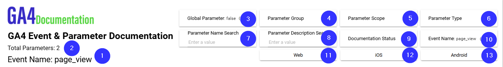
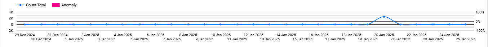
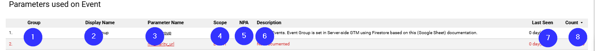

# GA4 Event & Parameter Documentation
This section contains information about **Fields** used on **GA4 Event & Parameter Documentation page**.

### Things to be aware of
Sometimes Looker Studio adds **Date Range Dimension** to charts by "itself". Date Range Dimensions are specified when to use.

* **Data Source:** ga4_documentation_parameters_and_documentation_status

| Number  | Field | Data Type | Field Type |
| ------------- | ------------- | ------------- | ------------- |
| 1 | Event Name Label \[Calc\] | Text | Metric | 
| 2 | Total Parameters \[Calc\] | Text | Metric | 
| 3 | ga4_config_parameter | Boolean | Control Field |
| 4 | parameter_group | Text | Control Field |
| 5 | parameter_scope | Text | Control Field |
| 6 | parameter_type | Text | Control Field |
| 7 | Parameter Name Search | | Control Field |
| 8 | Parameter Description Search | | Control Field |
| 9 | parameter_documentation_status_aggregated | Text | Control Field |
| 10 | event_name | Text | Control Field |
| 11 | platform_web | Boolean | Control Field |
| 12 | platform_ios | Boolean | Control Field |
| 13 | platform_android | Boolean | Control Field |

* **Data Source:** ga4_documentation_parameters_and_documentation_status

| Number  | Field | Data Type | Field Type |
| ------------- | ------------- | ------------- | ------------- |
| 1 | event_group | Text | Dimension |
| 2 | event_documentation_status | Text | Dimension |
| 3 | event_type | Text | Dimension |
| 4 | event_method | Text| Dimension |
| 5 | key_event_checkmark  | Text | Dimension |
| 6 | key_event_counting | Text | Dimension |
| 7 | platform_web_checkmark \[Calc\] | Text | Dimension |
| 8 | platform_ios_checkmark \[Calc\] | Text | Dimension |
| 9 | platform_android_checkmark \[Calc\] | Text | Dimension |
| 10 | event_first_seen_date_total | Date | Dimension |
| 11 | Event Last Seen Days \[Calc\] | Text | Dimension |
| 12 | event_count_total| Number | Metric |
| 13 | event_count_web| Number | Metric |
| 14 | event_count_ios| Number | Metric |
| 15 | event_count_android| Number | Metric |
| 16 | event_description | Text | Dimension |
| 17 | event_comment | Text | Dimension |
| 18 | event_gtm_comment | Text | Dimension |

* **Blended Data Source:** GA4 Event Name and Daily Event Count Blend

| Number  | Field | Data Type | Field Type |
| ------------- | ------------- | ------------- | ------------- |
| 1 | event_date | Date | Dimension |
| 2 | event_count_total | Number | Metric |
| 3 | net_change_percentage | Percent | Metric |
| 4 | event_count_web | Number | Optinal Metric |
| 5 | event_count_ios | Number | Optinal Metric |
| 6 | event_count_android | Number | Optinal Metric |

* **Data Source:** ga4_documentation_anomaly_detection

| Number  | Field | Data Type | Field Type |
| ------------- | ------------- | ------------- | ------------- |
| 1 | event_date | Date | Dimension |
| 2 | platform | Text | Dimension |
| 3 | anomaly_description | Text | Dimension |
| 4 | actual_count | Number | Metric |
| 5 | expected_count | Number | Metric |
| 6 | upper_bound | Number | Metric |
| 7 | lower_bound | Number | Metric |
| 8 | net_change_percentage | Percent | Metric |

* **Data Source:** ga4_documentation_parameters_and_documentation_status

| Number  | Field | Data Type | Field Type |
| ------------- | ------------- | ------------- | ------------- |
| 1 | parameter_group | Text | Dimension |
| 2 | parameter_display_name | Text | Dimension |
| 3 | Parameter Name URL \[Calc\] | Hyperlink | Dimension |
| 4 | parameter_scope | Text | Dimension |
| 5 | parameter_disallow_ads_personalization_checkmark \[Calc\] | Text | Dimension |
| 6 | parameter_description | Text | Dimension |
| 7 | Parameter Last Seen Days \[Calc\] | Text | Metric |
| 8 | parameter_count_total | Number | Metric |

* **Blended Data Source:** GA4 Image and Event Name Blend

| Number  | Field | Data Type | Field Type |
| ------------- | ------------- | ------------- | ------------- |
| 1 | event_name | Text | Dimension | 
| 2 | Event Image \[Calc\] | Image Link | Dimension |
